# Go HTTP服务器下载站-v0.0.5 gomail1

使用Go语言开发的高性能文件下载站，提供文件上传、下载、浏览、审核和管理功能，支持基于角色的用户权限控制。

**GitHub仓库链接**: [https://github.com/gomail1/go-download](https://github.com/gomail1/go-download)
**Docker仓库链接**: [https://hub.docker.com/r/gomail1/go_downloader](https://hub.docker.com/r/gomail1/go_downloader)

## 最新更新

### v0.0.5 版本内容

#### 🚀 核心功能优化
- ✅ **日志系统彻底重构**：实现智能日志级别分类系统，支持success、error、warning、debug 和info五种日志级别
- ✅ **性能与稳定性优化**：优化文件处理和数据查询逻辑，提高系统响应速度和稳定性
- ✅ **安全与权限增强**：改进权限验证逻辑，加强对敏感操作的访问控制
- ✅ **用户体验改进**：添加日志筛选功能，优化错误提示和界面交互
- ✅ **统计系统升级**：新增下载统计、带宽监控和热力图功能，提供更全面的系统监控

#### 🎯 最新功能更新
- ✅ **搜索栏支持**：添加文件搜索功能，方便用户快速查找文件
- ✅ **热力图统计功能**：新增可视化统计面板，实时展示文件分享和下载活动
- ✅ **API统计接口**：提供RESTful API接口，方便第三方系统集成统计数据（暂时未开放任何人也未对接任何服务器，后续会根据需求开放，目前仅限本地调用，还在测试阶段
- ✅ **带宽监控**：精确记录文件下载流量，帮助管理员了解带宽使用情况


热力图统计面板为管理员提供了直观的数据可视化功能，帮助了解文件分享和下载活动的趋势。面板包含以下主要组件：
1. **活动趋势图**：使用Chart.js创建的柱状图，展示最近7天的文件分享和下载活动趋势
2. **文件统计表**：详细的文件统计数据表格，包括文件路径、分享次数、下载次数、最后分享时间和最后下载时间
3. **实时数据**：数据实时更新，反映最新的文件使用情况 
4. **管理员专享**：只有管理员角色可以访问，确保数据安全性

热力图数据收集包括：
- 文件分享事件
- 文件下载事件
- 用户上传事件
- 管理员操作事件

所有数据都会经过标准化处理，确保路径一致性，并且会定期合并重复条目以保持数据准确性。

## 功能特性

### 🔐 权限管理系统
- **多角色权限控制**：支持管理员、普通用户和访客三种角色
- **细粒度权限分配**：针对不同角色分配不同的操作权限
- **会话管理**：基于Cookie的安全会话机制，支持自动登录

### 📁 文件管理功能
- **文件上传**：支持拖拽上传和批量上传
- **文件下载**：支持单文件和批量下载
- **文件浏览**：清晰的文件目录结构展示
- **文件删除**：支持单文件和批量删除
- **目录管理**：支持创建、删除目录

### 👥 用户管理系统
- **用户认证**：基于Cookie的安全认证机制
- **密码管理**：支持密码修改和强度验证
- **用户管理**：管理员可添加、删除用户

### 📊 统计与监控功能
- **下载统计**：精确记录每个文件的下载次数
- **分享统计**：跟踪文件分享活动
- **带宽监控**：实时监控文件传输带宽使用
- **热力图可视化**：图形化展示文件活动趋势

### 🛡️ 安全防护措施
- **访问控制**：严格的权限验证和访问控制
- **输入验证**：全面的输入参数验证和过滤
- **文件校验**：上传文件的类型和大小限制
- **防注入攻击**：防范常见的Web攻击手段


### 安全注意事项
- 定期更新服务器系统和依赖，修复安全漏洞

## 统计功能详解

### 📈 热力图面板
系统提供了直观的热力图统计面板，可通过 `/heatmap` 路径访问（仅限管理员）：
- 实时展示最近7天的文件分享和下载活动趋势
- 提供详细的文件统计信息表格，包括分享次数、下载次数、带宽使用等
- 图表化展示数据，便于管理员了解文件使用情况
- 包含文件路径、分享次数、下载次数、最后分享时间、最后下载时间等详细信息

热力图面板特色功能：
- **活动趋势图**：使用Chart.js创建的柱状图，清晰展示每日文件活动
- **文件统计表**：完整的文件统计数据表格，支持排序和筛选
- **实时数据**：数据实时更新，反映最新的文件使用情况
- **管理员专享**：只有管理员角色可以访问，确保数据安全性

### 📊 API统计接口
系统还提供了RESTful API接口供第三方系统集成：
- 获取所有文件的统计信息（JSON格式）
- 数据包含下载次数、分享次数、带宽使用等详细信息
- JSON格式返回，便于程序解析和处理
- 无需身份验证即可访问，方便集成到其他系统

### 🔄 数据处理
- 自动合并重复统计条目，确保数据准确性
- 定期清理任务，保持统计数据的一致性
- 支持子目录文件路径的正确识别和统计
- 数据持久化存储，重启服务后数据不丢失

### Docker部署方案

#### 1. 常规Docker部署
```yaml
version: '3.8'
services:
  go-download-server:
    # Docker Hub镜像
    image: gomail1/go_downloader:latest
    # 备选镜像源：GitHub Container Registry
    # image: ghcr.io/gomail1/go-download:latest
    container_name: go-download-server
    restart: unless-stopped
    ports:
      - "9980:9980"
      - "1443:1443"
    volumes:
      - ./downloads:/app/downloads
      - ./pending:/app/pending
      - ./logs:/app/logs
      - ./config:/app/config
      - ./ssl:/app/ssl
    environment:
      - TZ=Asia/Shanghai
    logging:
      driver: json-file
      options:
        max-size: "10m"
        max-file: "3"
```

#### 2. 飞牛专用部署
```yaml
version: '3.8'
services:
  go-download-server:
    image: gomail1/go_downloader:latest
    container_name: go-download-server
    restart: unless-stopped
    ports:
      - "9980:9980"
      - "1443:1443"
    volumes:
      - /vol1/1000/docker/go-download/downloads:/app/downloads
      - /vol1/1000/docker/go-download/pending:/app/pending
      - /vol1/1000/docker/go-download/logs:/app/logs
      - /vol1/1000/docker/go-download/config:/app/config
      - /vol1/1000/docker/go-download/ssl:/app/ssl
    environment:
      - TZ=Asia/Shanghai
    logging:
      driver: json-file
      options:
        max-size: "10m"
        max-file: "3"
```

#### 3. 1panel部署
```yaml
version: '3.8' 
 services: 
   go-download-server: 
     # Docker Hub镜像 
     image: gomail1/go_downloader:latest 
     # 备选镜像源：GitHub Container Registry 
     # image: ghcr.io/gomail1/go-download:latest 
     container_name: go-download-server 
     restart: unless-stopped 
     ports: 
       - "9980:9980" 
       - "1443:1443" 
     volumes: 
       - ./downloads:/app/downloads 
       - ./pending:/app/pending 
       - ./logs:/app/logs 
       - ./config:/app/config 
       - ./ssl:/app/ssl 
     environment: 
        TZ: Asia/Shanghai 
     logging: 
       driver: json-file 
       options: 
         max-size: "10m" 
         max-file: "3"
```

## 操作界面演示-v0.0.3

以下是系统主要功能的操作界面演示：

### 1. 公众主界面
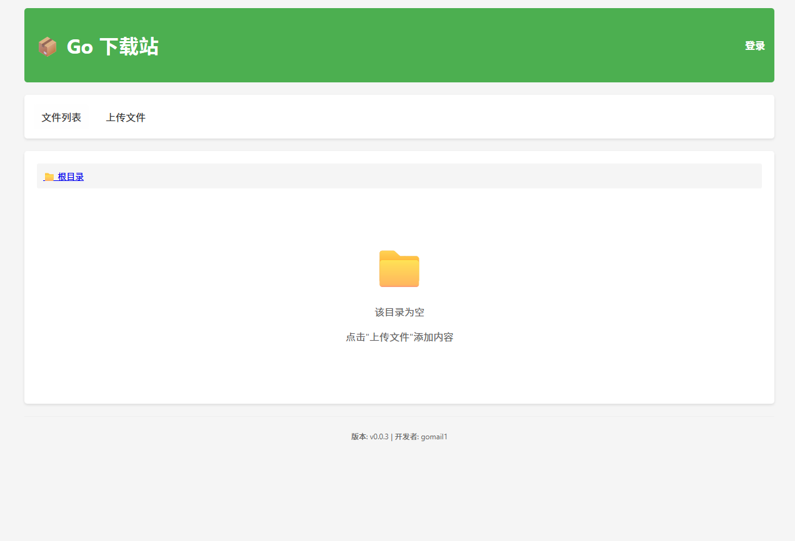

### 2. 上传界面
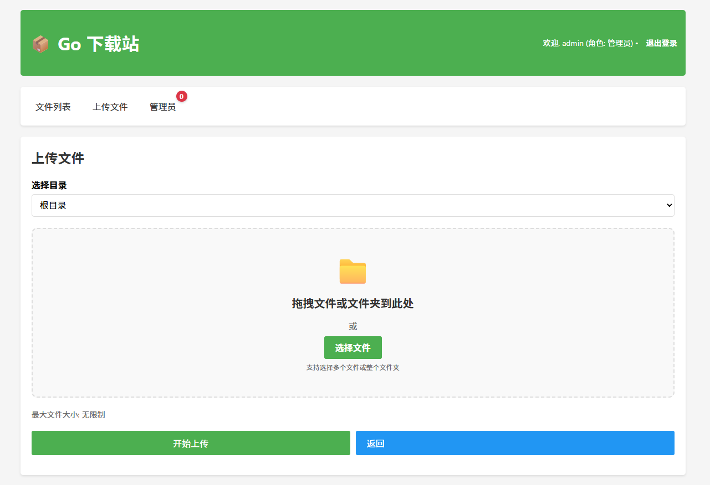

### 3. 管理员界面
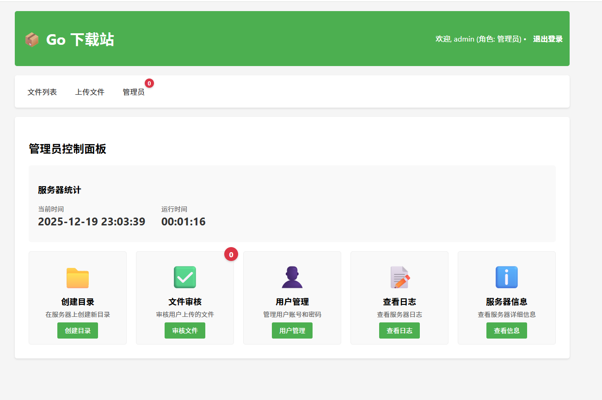

### 4. 创建目录
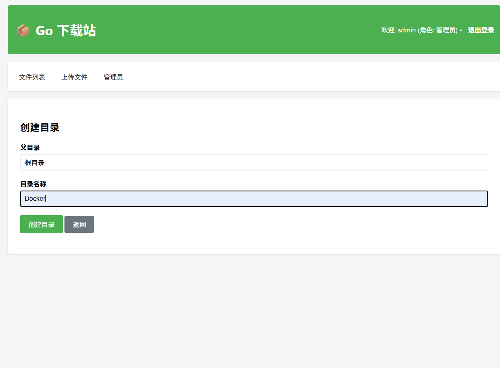

### 5. 用户上传界面
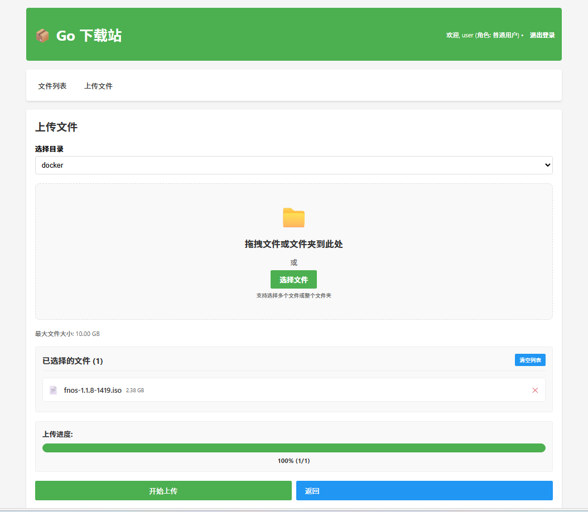

### 6. 管理员审核提醒
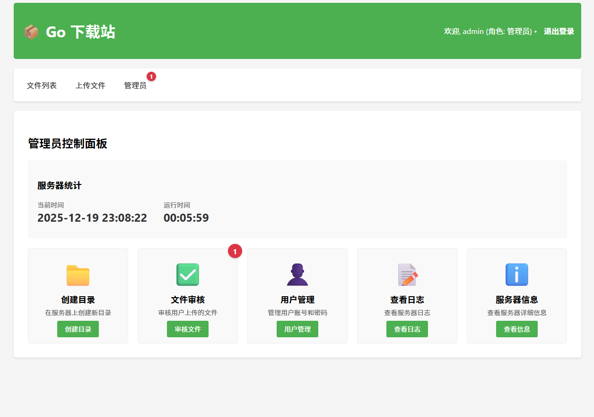

### 7. 管理员审核目录
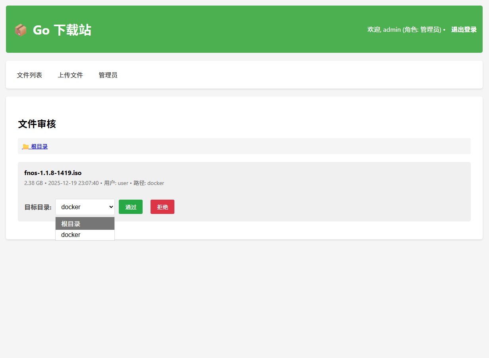

### 8. 用户管理界面
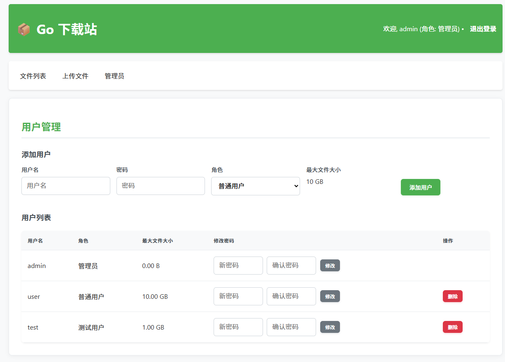

### 9. 详细日志
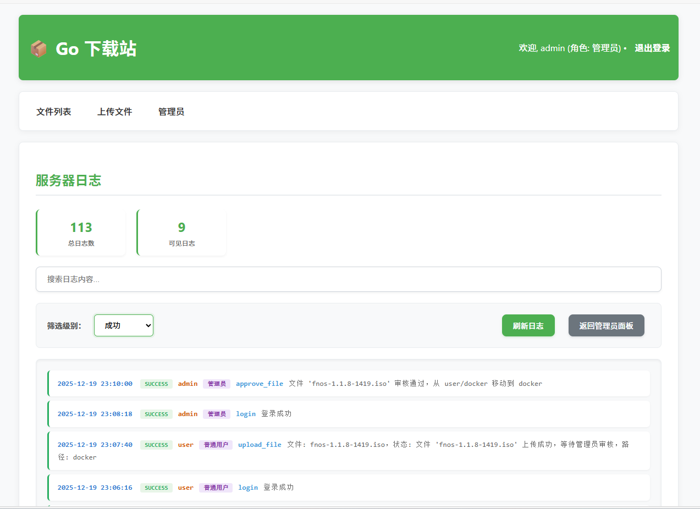

### 10. 服务器信息
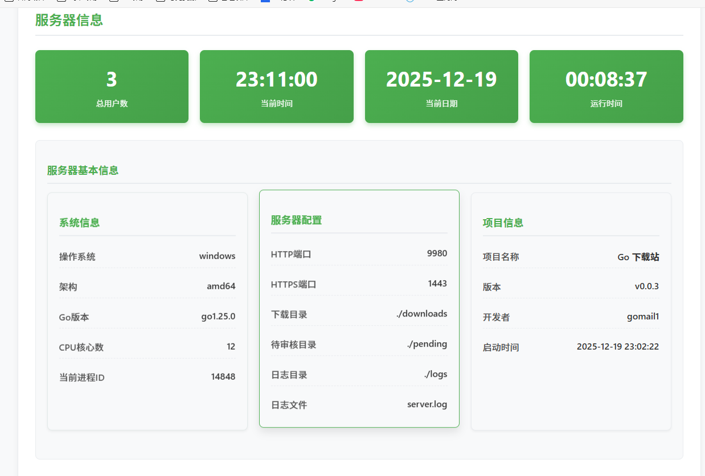

### 11. 热力图统计面板
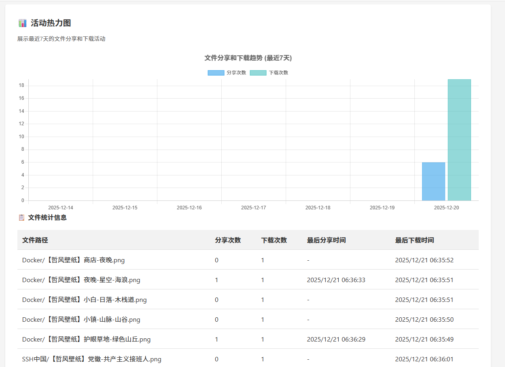


## 技术实现

本项目提供基于Docker的容器化部署方案，无需直接编译源代码。

- **容器化部署**: 使用Docker容器化技术，简化部署和管理
- **跨平台支持**: 支持Windows、Linux和Mac系统
- **双协议支持**: 同时支持HTTP和HTTPS访问
- **持久化存储**: 支持数据持久化到主机文件系统
- **自动配置**: 首次运行自动生成配置文件


## 开发说明

此项目使用纯Go标准库开发，无需额外的数据库依赖。所有文件操作都是直接文件系统操作，适合中小型文件分享场景。

## 许可证

MIT License