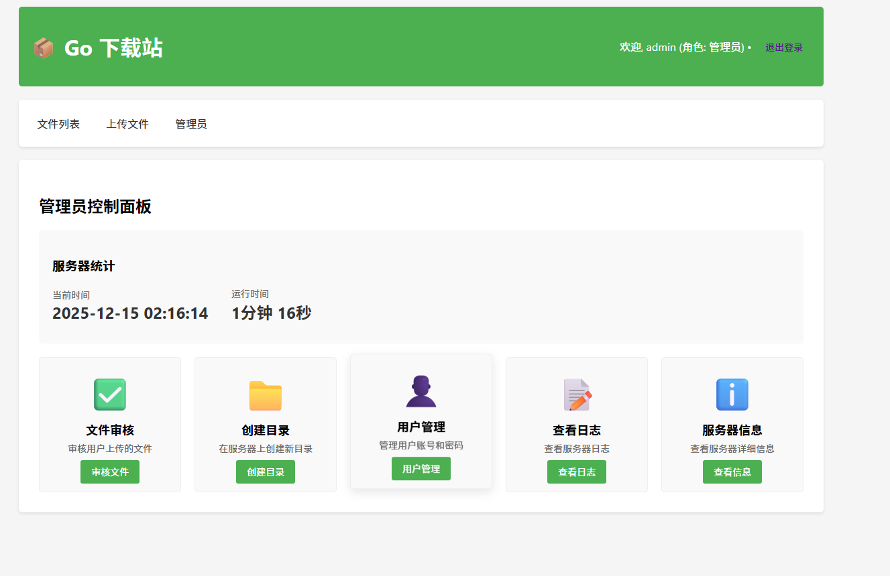
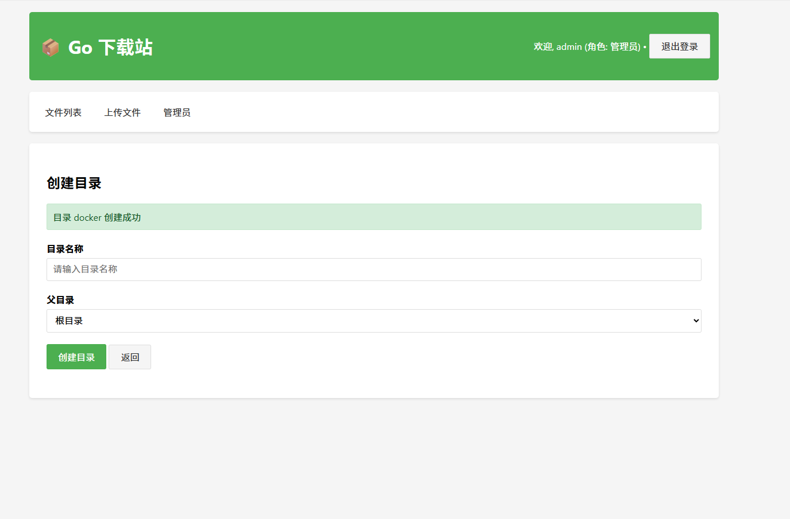
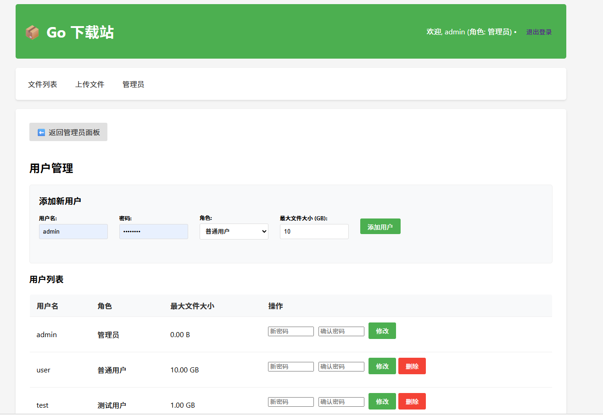
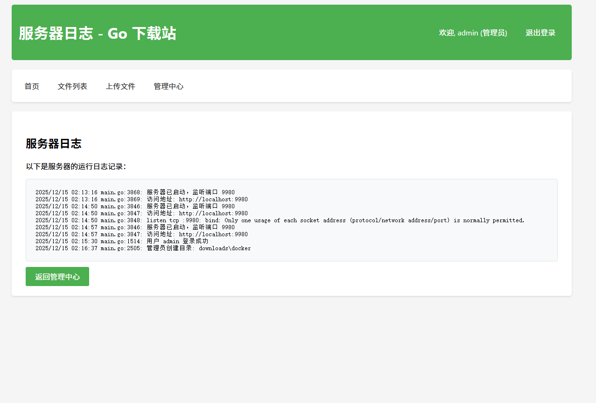

# Go HTTP服务器下载站-v0.0.2 gomail1  

使用Go语言开发的高性能文件下载站，提供文件上传、下载、浏览、审核和管理功能，支持基于角色的用户权限控制。

**GitHub仓库链接**: [https://github.com/gomail1/go-download](https://github.com/gomail1/go-download)
**Docker仓库链接**: [https://hub.docker.com/r/gomail1/go_downloader](https://hub.docker.com/r/gomail1/go_downloader)

## 更新项目介绍

### v0.0.2 版本更新内容

#### 日志系统优化
- ✅ **统一日志记录**：实现了结构化日志记录功能，支持不同日志级别
- ✅ **日志页面增强**：美化了日志页面UI，添加了搜索和筛选功能
- ✅ **日志统计**：显示总日志数和当前可见日志数
- ✅ **结构化日志格式**：包含时间戳、级别、用户名、角色、操作和详情
- ✅ **用户操作日志**：为所有关键操作添加了日志记录
- ✅ **日志倒序显示**：最新日志显示在前面，方便查看
- ✅ **智能滚动**：页面加载时自动滚动到顶部，确保看到最新日志
- ✅ **完善的日志记录**：覆盖所有关键操作，包括登录、退出、上传、下载、审核、删除等

#### 服务器信息页面增强
- ✅ **系统信息显示**：显示操作系统、架构、Go版本、CPU核心数等
- ✅ **服务器配置显示**：显示端口、下载目录、待审核目录等
- ✅ **项目信息显示**：显示项目名称、版本、开发者、启动时间等
- ✅ **内存使用信息**：显示当前协程数
- ✅ **用户角色权限表**：清晰展示不同角色的权限对比
- ✅ **使用说明**：添加了系统使用说明

#### 项目结构优化
- ✅ **模块化拆分**：将代码拆分为config、constants、session、utils和handlers等多个功能模块
- ✅ **处理器分离**：每个HTTP请求处理器独立为单独文件，提高代码可维护性
- ✅ **配置统一管理**：配置文件和配置管理代码统一放在config目录
- ✅ **代码组织优化**：按功能职责清晰划分，便于扩展和维护

#### 功能增强
- ✅ **用户管理**：完善的用户添加、删除和密码修改功能
- ✅ **文件审核**：独立的审核通过和拒绝处理流程
- ✅ **目录管理**：支持多级目录创建和管理
- ✅ **服务器监控**：提供详细的服务器信息和运行状态
- ✅ **待审核文件隔离**：普通用户和测试用户上传的待审核文件进行隔离
- ✅ **管理员账号保护**：管理员账号默认不可删除，只能修改密码
- ✅ **创建目录优化**：将创建目录功能放到审核文件前面
- ✅ **父目录显示优化**：将父目录显示改为"根目录"

#### UI优化
- ✅ **界面大小统一**：统一了所有页面的容器宽度
- ✅ **消息提醒优化**：添加了5秒后自动消失的消息提醒
- ✅ **角色显示优化**：修复了角色显示问题，确保角色名称正确显示
- ✅ **端口显示修复**：修复了端口格式化错误

#### 安全性改进
- ✅ **文件名安全**：完善的文件名清理机制
- ✅ **权限控制**：严格的基于角色的权限检查
- ✅ **文件操作日志**：所有文件操作都有日志记录
- ✅ **用户行为监控**：记录用户登录、退出、上传、下载等行为

#### 部署优化
- ✅ **配置自动生成**：首次运行自动生成配置文件
- ✅ **启动脚本更新**：修复启动脚本中的端口和目录问题
- ✅ **Docker配置优化**：修复配置文件复制路径

### v0.0.1 版本内容

- ✅ **基础功能实现**：文件上传、下载、浏览
- ✅ **用户角色系统**：管理员、普通用户、测试用户
- ✅ **文件审核机制**：待审核文件管理
- ✅ **简单日志系统**：基础日志记录
- ✅ **配置文件支持**：JSON配置文件
- ✅ **Docker支持**：Docker容器化部署
- ✅ **Windows启动脚本**：支持Windows系统部署
- ✅ **Linux/Mac启动脚本**：支持Linux/Mac系统部署

## 风险警示

⚠️ **重要安全提示**

- 本项目作为公开文件下载站，存在被恶意扫描、刷流量、滥用下载等风险
- 建议部署在受保护的网络环境中，或添加IP访问控制
- 定期检查服务器日志，及时发现异常访问
- 考虑添加访问速率限制，防止恶意刷流量
- 建议启用HTTPS，增强数据传输安全性
- 定期更新服务器系统和依赖，修复安全漏洞

## 功能特性

### 🏗️ 基础架构
- 🚀 **高性能**: 基于Go语言的HTTP服务器，高并发处理能力
- 🎨 **响应式设计**: 适配各种设备的现代Web界面
- 🔒 **安全防护**: 文件名清理，防止路径遍历攻击
- 📝 **配置文件**: 基于JSON的用户和服务器配置管理
- 🔒 **HTTPS支持**: 支持HTTPS安全访问，可配置HTTPS端口和SSL证书
- ⚡ **双协议支持**: 同时支持HTTP和HTTPS访问，灵活选择

### 📦 文件管理
- 📁 **文件浏览**: 美观的Web界面浏览可下载文件，支持目录导航
- ⬆️ **文件上传**: 支持选择上传目录，多用户角色权限控制
- 🗑️ **文件管理**: 在线删除文件，文件信息查看，目录创建和管理
- ✅ **文件审核**: 普通用户和测试用户上传的文件需要管理员审核
- 📁 **目录选择**: 上传和审核时可选择目标目录
- 🔒 **待审核文件隔离**: 普通用户和测试用户上传的待审核文件进行隔离

### 👥 用户系统
- 👤 **用户角色**: 支持管理员、普通用户、测试用户三种角色
- 👥 **用户管理**: 管理员可添加、删除用户，配置角色和权限
- 🔧 **密码管理**: 支持修改用户密码
- 📊 **用户列表**: 表格形式展示用户信息，方便管理
- 🔒 **管理员保护**: 管理员账号默认不可删除

### 📊 统计与监控
- 📊 **统计信息**: 服务器运行状态、文件统计等
- 📊 **服务器信息**: 详细的系统信息、配置信息和运行状态
- 📋 **服务器日志**: 结构化日志记录，支持搜索和筛选功能
- 📝 **结构化日志**: 包含时间戳、级别、用户名、角色、操作和详情
- 🔍 **日志搜索**: 支持日志内容搜索和级别筛选
- 📋 **日志统计**: 显示总日志数和当前可见日志数

### 💡 其他功能
- 📈 **实时更新**: 文件列表实时刷新，搜索过滤功能
- ⚠️ **消息提醒**: 5秒后自动消失的消息提醒

## 项目结构

```
go-download-server/
├── main.go              # 主程序文件
├── go.mod               # Go模块文件
├── go-download-server.exe  # 编译后的可执行文件
├── start.bat            # Windows启动脚本
├── start.sh             # Linux/Mac启动脚本
├── config/              # 配置相关
│   ├── config.go        # 配置管理代码
│   └── config.json      # 配置文件
├── constants/           # 常量定义
│   └── constants.go     # 常量定义文件
├── session/             # 会话管理
│   └── session.go       # 会话管理代码
├── utils/               # 工具函数
│   └── utils.go         # 工具函数实现
├── handlers/            # HTTP请求处理器
│   ├── admin.go         # 管理员页面
│   ├── approve.go       # 文件审核通过处理
│   ├── delete.go        # 文件删除处理
│   ├── download.go      # 文件下载处理
│   ├── files.go         # 文件列表处理
│   ├── info.go          # 服务器信息
│   ├── login.go         # 登录登出处理
│   ├── logs.go          # 日志查看
│   ├── mkdir.go         # 创建目录处理
│   ├── reject.go        # 文件审核拒绝处理
│   ├── review.go        # 文件审核页面
│   ├── upload.go        # 文件上传处理
│   └── user.go          # 用户管理（添加、删除、修改密码）
├── downloads/           # 下载文件存储目录
├── pending/             # 待审核文件目录
├── logs/                # 服务器日志目录
├── ssl/                 # SSL证书目录
└── README.md            # 项目说明文档
```

## GO语言直接部署

### 1. 安装依赖

```bash
go mod tidy
```

### 2. 配置文件

服务器会在首次运行时自动生成配置文件 `config/config.json`，无需手动创建。

#### 自动生成配置

如果 `config/config.json` 文件不存在，服务器会在首次运行时自动生成默认配置，包含以下账号：
- 管理员：admin/admin123
- 普通用户：user/user123
- 测试用户：test/test123

如果需要自定义用户账号和密码，请编辑 `config/config.json` 文件。
如果出现错误请按照以下**完整配置结构：**进行修改。

**注意事项：**
- 用户管理功能会自动更新 `config/config.json` 文件

**完整配置结构：**

```json
{
  "users": [
    {
      "username": "admin",
      "password": "admin123",
      "role": "admin",
      "max_file_size": 0
    },
    {
      "username": "user",
      "password": "user123",
      "role": "normal",
      "max_file_size": 10737418240
    },
    {
      "username": "test",
      "password": "test123",
      "role": "test",
      "max_file_size": 1073741824
    }
  ],
  "server": {
    "port": 9980,
    "https_port": 9443,
    "cert_file": "./ssl/cert.pem",
    "key_file": "./ssl/key.pem",
    "download_dir": "./downloads",
    "pending_dir": "./pending",
    "log_dir": "./logs",
    "log_file": "server.log"
  }
}
```

**使用说明：**
- 首次部署后，请登入主界面进行修改默认密码  
- 用户管理功能会自动更新 `config/config.json` 文件
- 可以直接编辑 `config/config.json` 文件修改配置（注意修改后需要重启服务器生效）
- 支持通过Web界面的用户管理功能修改用户信息和密码

**HTTPS配置说明：**
- 默认HTTPS端口：9443
- 默认证书路径：`./ssl/cert.pem` 和 `./ssl/key.pem`
- 生成自签名证书命令：
  ```bash
  openssl req -x509 -newkey rsa:4096 -nodes -out ./ssl/cert.pem -keyout ./ssl/key.pem -days 365
  ```
- 证书文件不存在时，服务器会自动启动HTTP服务，HTTPS服务会给出警告信息
- 可以在 `config/config.json` 文件中修改HTTPS端口和证书路径

**支持多种证书配置方式：**
1. **配置文件配置**：在 `config/config.json` 文件中设置证书路径
2. **命令行参数配置**：
   ```bash
   go run main.go --https-port=9443 --cert-file=./ssl/my-cert.pem --key-file=./ssl/my-key.pem
   ```
3. **环境变量配置**：
   ```bash
   export HTTPS_PORT=9443
   export SSL_CERT_FILE=./ssl/my-cert.pem
   export SSL_KEY_FILE=./ssl/my-key.pem
   go run main.go
   ```

**配置优先级：**
- 命令行参数 > 环境变量 > 配置文件 > 默认值

**证书文件读取模式：**
- 支持任意名称的证书文件
- 支持绝对路径和相对路径
- 自动检查证书文件是否存在
- 支持不同格式的证书文件（.pem, .crt, .key等）

### 3. 运行服务器

#### 使用启动脚本

**Windows系统：**
```bash
start.bat
```

**Linux/Mac系统：**
```bash
chmod +x start.sh
./start.sh
```

#### 直接运行

```bash
go run main.go
```

服务器将在 `http://localhost:9980` 启动

### 4. 访问服务

打开浏览器访问: `http://localhost:9980`


## 常规Docker部署方案

### Docker Compose部署

使用Docker Compose可以更方便地管理和部署应用。创建`docker-compose.yml`文件，内容如下：

```yaml
version: '3.8'

services:
  go-download-server:
    # Docker Hub镜像
    image: gomail1/go_downloader:latest
    # 备选镜像源：GitHub Container Registry
    # image: ghcr.io/gomail1/go-download:latest
    container_name: go-download-server
    restart: unless-stopped
    ports:
      - "9980:9980"
    volumes:
      - ./downloads:/app/downloads
      - ./pending:/app/pending
      - ./logs:/app/logs
      - ./config:/app/config
    environment:
      - TZ=Asia/Shanghai
    logging:
      driver: json-file
      options:
        max-size: "10m"
        max-file: "3"
```

### 注意事项

- 配置文件将在首次运行时自动生成
- 服务启动后可访问：`http://localhost:9980`
- 所有数据将自动持久化到当前目录下的`downloads`、`pending`、`logs`和`config`目录
- 如需修改端口或其他配置，可直接编辑`docker-compose.yml`文件后重启服务


## 飞牛专用部署方案

### 1. 配置文件说明

飞牛系统推荐使用docker-compose进行部署，已创建好的`docker-compose.yml`文件提供了两种镜像源的配置选项（GitHub Container Registry和Docker Hub），您可以根据需要选择使用：
配置内容：

```yaml
version: '3.8'
services:
  go-download-server:
    image: gomail1/go_downloader:latest
    container_name: go-download-server
    restart: unless-stopped
    ports:
      - "9980:9980"
    volumes:
      - /vol1/1000/docker/go-download/downloads:/app/downloads
      - /vol1/1000/docker/go-download/pending:/app/pending
      - /vol1/1000/docker/go-download/logs:/app/logs
      - /vol1/1000/docker/go-download/config:/app/config
    environment:
      - TZ=Asia/Shanghai
    logging:
      driver: json-file
      options:
        max-size: "10m"
        max-file: "3"
```

**镜像源说明：**
- **GitHub Container Registry**: [ghcr.io/gomail1/go-download:latest](https://github.com/gomail1/go-download/pkgs/container/go-download)
- **Docker Hub**: [gomail1/go_downloader:latest](https://hub.docker.com/r/gomail1/go_downloader)

您可以根据网络环境和访问偏好选择其中一个镜像源，默认使用Docker Hub镜像。

注意事项：
1：飞牛系统中，所有数据将持久化存储在`/vol1/1000/docker/go-download/`目录下。
2：配置文件将在首次运行时自动生成。

### 2. 飞牛系统持久化配置

飞牛系统中，所有数据将持久化存储在以下目录：

```
/vol1/1000/docker/go-download/
├── downloads/    # 下载文件目录
├── pending/      # 待处理文件目录
├── logs/         # 日志文件目录
└── config/       # 配置目录
    └── config.json   # 配置文件
```

确保该目录权限设置正确，以便容器能够正常读写数据。

## 用户角色和权限

### 1. 管理员 (admin)
- **账号**: admin / admin123
- **权限**: 
  - 浏览、下载、上传文件（无大小限制）
  - 直接上传文件到下载目录（无需审核）
  - 创建、管理下载目录
  - 审核普通用户和测试用户上传的文件
  - 查看服务器日志和详细信息
  - 删除文件和目录

### 2. 普通用户 (normal)
- **账号**: user / user123
- **权限**:
  - 浏览、下载文件
  - 上传文件（最大10GB）
  - 上传的文件需要管理员审核
  - 查看自己的上传审核进度

### 3. 测试用户 (test)
- **账号**: test / test123
- **权限**:
  - 浏览、下载文件
  - 上传文件（最大1GB）
  - 上传的文件需要管理员审核
  - 查看自己的上传审核进度

## 使用说明

### 文件上传
1. 登录系统
2. 点击"上传文件"按钮
3. 选择要上传的文件
4. **选择目标目录**（可选择根目录或子目录）
5. 点击"开始上传"按钮
6. 等待上传完成

### 文件审核
1. 以管理员身份登录
2. 点击"文件审核"按钮
3. 浏览待审核的文件
4. **选择目标目录**（可选择根目录或子目录）
5. 点击"通过"按钮审核通过，或点击"拒绝"按钮拒绝
6. 审核通过的文件将被移动到指定的下载目录

### 文件下载
1. 浏览文件列表
2. 点击文件名直接下载
3. 支持按文件名搜索和过滤

### 目录管理
1. 以管理员身份登录
2. 在文件列表页面点击"创建目录"按钮
3. 输入目录名称
4. 选择父目录
5. 点击"创建"按钮

### 服务器日志和信息
1. 以管理员身份登录
2. 点击"查看服务器日志"按钮查看运行日志
3. 点击"查看服务器详细信息"按钮查看系统状态

### 用户管理
1. 以管理员身份登录
2. 点击"用户管理"按钮进入用户管理页面
3. **用户列表**: 以表格形式展示所有用户信息，包括用户名、角色、最大文件大小和操作
4. **添加用户**:
   - 填写用户名、密码
   - 选择角色（普通用户/测试用户）
   - 设置最大文件大小
   - 点击"添加用户"按钮
5. **修改密码**:
   - 在用户列表中找到要修改的用户
   - 在"新密码"和"确认密码"输入框中填写新密码
   - 点击"修改"按钮
6. **删除用户**:
   - 在用户列表中找到要删除的用户
   - 点击"删除"按钮
   - 确认删除操作
   - **注意**: 管理员账户（admin）默认不可删除

### 用户角色和权限配置
1. 管理员可以在添加或编辑用户时配置角色
2. **角色说明**:
   - **管理员(admin)**: 具有所有权限，上传文件无需审核
   - **普通用户(normal)**: 可以上传和下载文件，上传文件需要审核
   - **测试用户(test)**: 权限与普通用户类似，但上传文件大小限制较小
3. 每个用户可以设置不同的最大文件上传大小
4. 用户配置会自动保存到`config/config.json`文件中

## 技术实现

- **HTTP服务**: Go标准库 net/http
- **路由处理**: http.ServeMux (Go标准库)
- **文件处理**: io, os, path/filepath
- **前端界面**: 响应式HTML/CSS/JavaScript
- **配置管理**: JSON格式配置文件
- **用户认证**: 基于配置文件的认证系统
- **权限控制**: 基于角色的访问控制（RBAC）
- **文件大小**: 智能格式转换 (B, KB, MB, GB)
- **零外部依赖**: 仅使用Go标准库，无需额外安装包

## 安全特性

- 文件名清理和验证
- 路径遍历攻击防护（使用filepath.Clean）
- 基于角色的权限控制
- 最大文件大小限制
- 安全的文件删除机制
- 目录遍历防护

## 操作界面演示-v0.0.1版本演示

以下是系统主要功能的操作界面演示：

### 1. 主界面


### 2. 管理员界面


### 3. 创建目录


### 4. 创建成功主界面


### 5. 用户管理界面


### 6. 服务器日志


### 7. 服务器信息


### 8. 用户上传文件


### 9. 管理员审核界面


### 10. 审核通过发布界面


## 开发说明

此项目使用纯Go标准库开发，无需额外的数据库依赖。所有文件操作都是直接文件系统操作，适合中小型文件分享场景。

## 许可证

MIT License