# Go HTTP服务器下载站 - V1.3.0

使用Go语言开发的高性能文件下载站，提供文件上传、下载、浏览、审核和管理功能，支持基于角色的用户权限控制、全平台响应式设计、多协议下载功能，以及完善的安全防护和监控告警系统。

**GitHub仓库链接**: [https://github.com/gomail1/go-download](https://github.com/gomail1/go-download)
**Docker仓库链接**: [https://hub.docker.com/r/gomail1/go_downloader](https://hub.docker.com/r/gomail1/go_downloader)

## 📸 操作演示

### 前端首页


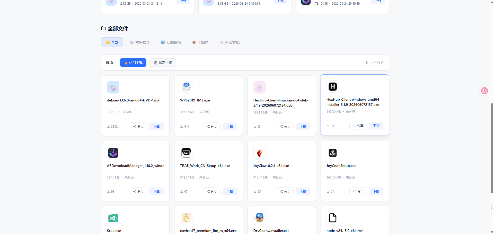

### 管理后台

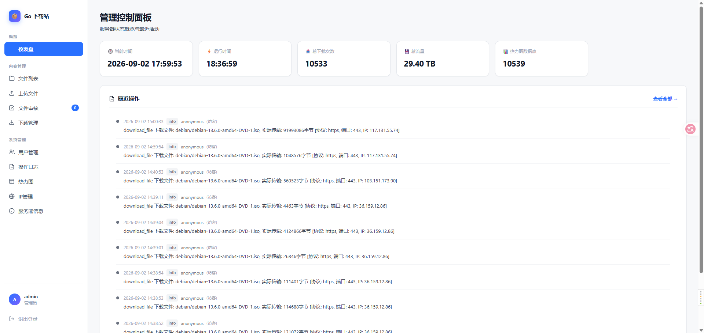

### 文件管理

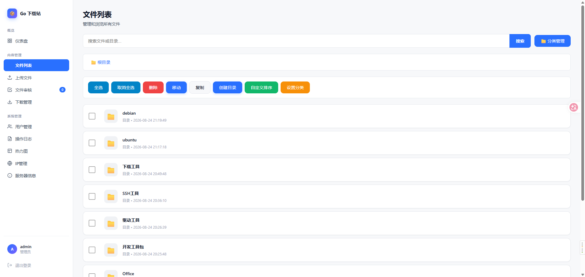

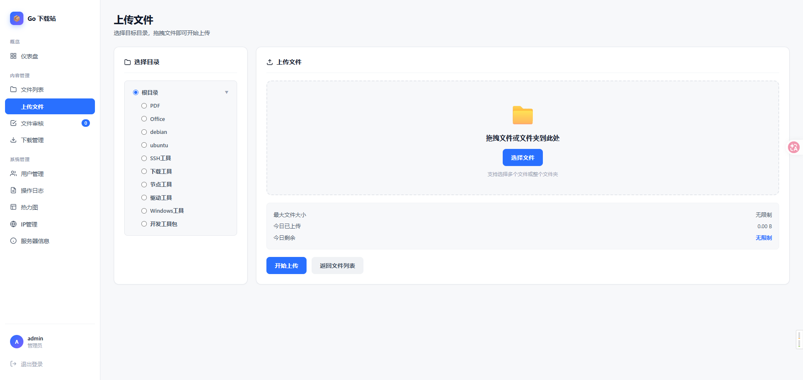

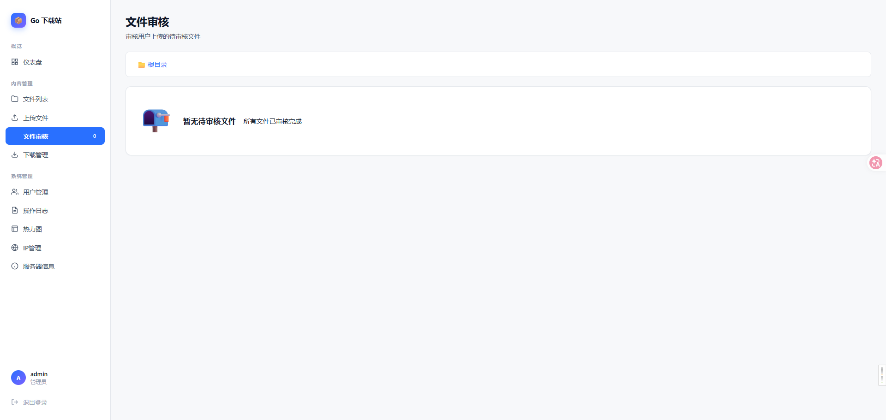

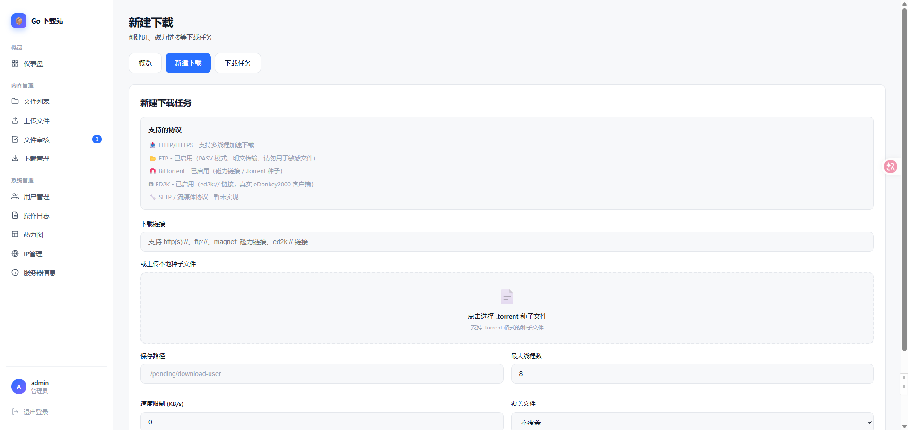

### 用户与权限管理

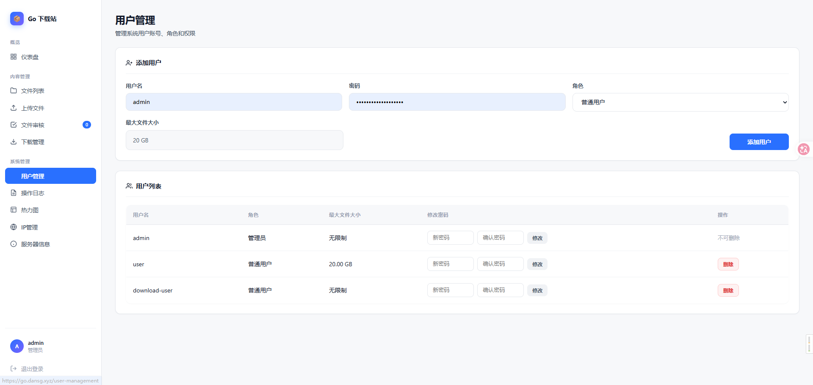

### 系统监控与日志

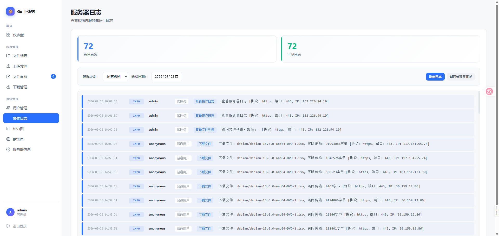

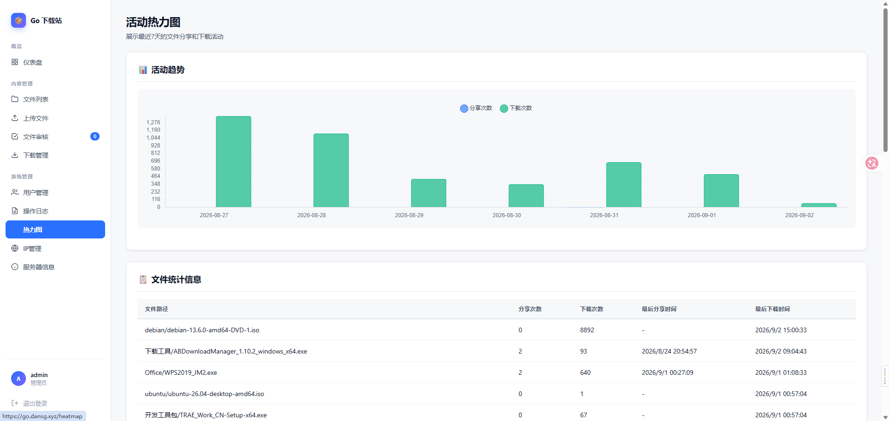

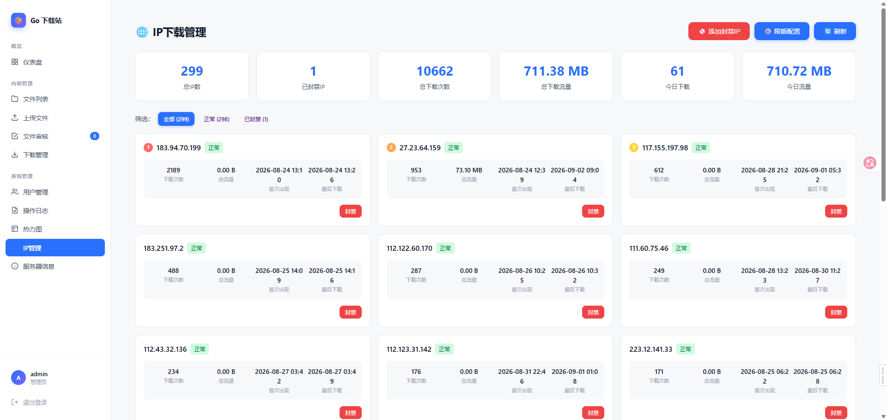

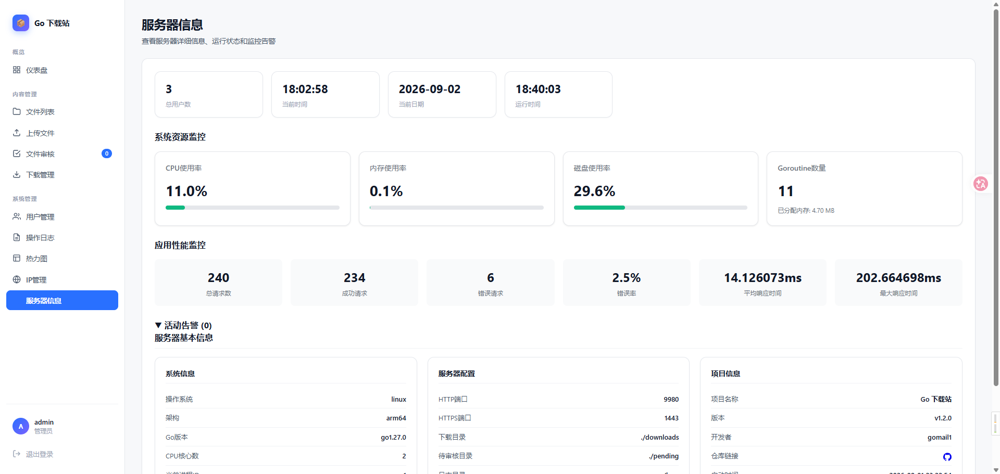

## 📢 最新更新

### V1.3.0 版本内容 (2026-09-05)

#### 🛡️ 安全加固（全量代码审查修复）
1. **SSRF 防护（新增）**
   - 远程下载任务仅允许 http/https/ftp/magnet 协议，拒绝 `file://` 及内网/回环/链路本地/云元数据地址（如 `127.0.0.1`、`169.254.169.254`）
   - HTTP 下载使用自定义安全拨号器，**每次连接前校验解析后的真实 IP**，防 DNS rebinding 与重定向绕过
2. **下载管理权限收紧**
   - 下载任务管理、下载统计接口仅**管理员/二级管理员**可用，普通用户不再能创建远程下载任务
3. **任意文件写入防护**
   - BT 种子内文件名、FTP 远端文件名统一清洗（过滤 `../`、控制字符、Windows 保留名，长度截断）
   - 所有协议落盘路径统一安全拼接校验（`SafeJoinFile`），杜绝路径穿越
   - 种子文件上传保存到独立临时目录 `tmp/torrents/` 并清洗文件名
4. **依赖漏洞修复**
   - `disintegration/imaging` v1.6.2 → `vtemlabs/imaging` v1.6.4（**CVE-2023-36308**：TIFF 解码整数越界可致 panic）
5. **密码与统计接口清理**
   - 启动时自动检测并**强制升级明文密码为 bcrypt**（含历史配置文件），`config.json` 及备份文件权限收紧至 0600
   - 密码明文回退比较改恒定时间，消除时序侧信道
   - 移除从未生效的 gin `/stats` 死路由，统计接口统一为 `/api/stats`（文件/分享下载统计，管理员会话或 API Key 认证）

#### ⚙️ 稳定性与并发修复
1. **下载引擎并发安全**：Task 对象广播与持久化前统一深拷贝快照，消除 data race
2. **HTTP 分块下载修复**：修复小文件分块下载必失败的 bug（Go 允许一次 `Read` 同时返回数据与 EOF，原逻辑丢弃末轮数据并误判下载不完整）
3. **任务持久化原子写**：写入改用临时文件 + 原子替换，崩溃不再残留半截 JSON 导致任务丢失
4. **context 生命周期**：下载任务随引擎生命周期正确取消，完成后不再泄漏 context 资源
5. **暂停支持准备阶段**：BT 任务在获取元数据阶段（preparing）也可暂停/恢复
6. **优雅停机**：关闭时通过 WaitGroup 等待下载协程真正退出，不再固定 Sleep
7. **会话读取性能**：会话查询由写锁改为读锁，消除每请求串行化
8. **崩溃自动恢复**：进程强杀/崩溃遗留的 `downloading`/`preparing`/`waiting` 中间态任务，重启后自动重入队恢复下载（`downloading` 按 `.downloading.json` 断点续传）
9. **限速下载修复**：修复令牌桶空转导致的限速下载停滞；移除全局 30s 客户端超时（会掐断慢速限速下载），改为响应头超时 + 任务上下文管理生命周期
10. **IP 下载统计回填修复（09-06 补充）**：历史日志回填仅在 `logs/ip_stats.json` 为空时执行——日志与统计是同一下载事件的双写，旧逻辑只要 `.ip_stats_imported` 标记缺失就把日志再累加一遍，导致**全站下载次数/流量翻倍**；回填改为按 (IP+文件) 60s 合并窗口折算（兼容修复前逐分片计数的旧日志，防虚高）；补扫 `.gz` 轮转压缩日志（防漏统计）；ip_stats 挂入 5 分钟周期兜底落盘（防崩溃丢最近记录）。存量污染数据提供**三种一键修复途径**：IP 管理页「🧰 自检修复」按钮（界面自检+重建）、启动参数 **`-rebuild-ipstats`**、配置项 **`server.rebuild_ipstats_on_boot: true`**（均自动备份 `ip_stats.json.bak.<时间戳>` + 保留封禁状态）
11. **热力图下载热度分片修复（09-06 补充）**：热力图与下载计数同源——旧版每个 Range 分片传输都追加一个 download 数据点，导致活动热力图近 7 天「下载」热度/柱状虚高（与 IP 统计同源的分片重复 bug）。已修复：实时路径热力点移入 (IP+文件) 60s 逻辑下载合并窗口（分片不再加点）；启动加载时对存量污染点做**幂等压缩迁移**（先按时间稳定排序再滑动窗口合并，兼容乱序数据，share 等其他类型不受影响），升级后首次启动自动生效并打印「压缩了 N 条重复热力图 download 点」
12. **文件统计(stats.json)历史重建（09-06 补充）**：首页「累计下载」、文件列表每文件次数、热力图读的都是 `config/stats.json`——旧版每个 Range 分片传输都会 **+1 download_count、追加热力点，并按整文件大小累加 total_bandwidth**，导致比 IP 统计更严重的污染（真实服务器实证：累计 12535 次/30TB → 日志真值 1048 次/43.75GB，次数虚高 12 倍、流量虚高约 690 倍）。已修复：实时路径不再分片累加（含热力点随 #11 一并修正），并新增**按历史日志一键重建 stats.json**——首页「🧰 自检修复」弹窗升级为双卡（IP 统计 + 文件统计/热力图，各自对账与执行修复）；启动参数 **`-rebuild-stats`**；配置项 **`server.rebuild_stats_on_boot: true`**。重建以 (IP+文件) 60s 合并口径从全部日志（含 `.gz`）重算每文件下载次数/带宽/热力点；**分享计数按日志补齐（只增不删，见 #18），上传时间保留原值**，自动备份 `stats.json.bak.<时间戳>`，可重复执行
13. **客户端 IP 来源校验加固（09-06 补充）**：取客户端 IP 时对 `X-Forwarded-For` / `X-Real-IP` 头值做 **IP 格式校验（`net.ParseIP`）**，非法值（伪造头注入任意字符串 / 冒用他人 IP / 携带端口或域名）一律拒绝并回退到 TCP 对端地址——避免伪造 IP 绕过按 IP 下载限额、污染 IP 统计 / 热力图 / 审计日志，从源头阻断存储型注入（展示端另有 HTML/JS 双转义兜底）
14. **登录/协议/角色权限模型重构（09-07 补充）**：
	① **协议页「同意」按角色跳转**：管理员/二级管理员 → 管理后台 `/admin`，普通用户 → 上传界面 `/upload`（原写死跳首页）；
	② **全站解锁机制**：前端（首页 `/`）是否展示下载目录文件由**站点解锁状态**决定——`config.json` 中**任一顶级管理员(role=admin)同意过免责协议即解锁全站**（状态持久化，重启有效），此前首页对匿名/未同意协议完全开放、协议门槛形同虚设；未解锁时首页保持正常观感但**文件区留白**，不渲染任何下载目录内容（含后端预置文件）；
	③ **个人协议关卡**：任何角色登录后未同意协议即被引导到协议页；二级管理员/普通用户的同意仅代表个人确认，**不触发全站解锁**；
	④ **角色权限收敛**：普通用户仅开放上传——登录直达 `/upload` 专用简化界面（无管理侧边栏、不展示下载目录结构、上传进待审核区），访问 `/files`、`/admin`、`/review`、`/user-management` 等一律按角色提示无权限；二级管理员管理后台隐藏「用户管理」「IP管理」（含自检修复）入口与页面（仅顶级管理员可用）；
	⑤ **管理路由入口收敛到后台**：协议页顶部导航不再出现「文件列表/上传文件」等管理链接；首页页脚登录/未登录一致（不再出现使用条款等登录态差异入口）。

15. **下载专用账号锁定 + 二级管理员配额显示修复（09-07 补充）**：
	① **download-user（download 角色）完全锁定**：此账号仅作下载用途——登录接口直接拒绝（即使配置了密码也禁止登录，并修复了此前 download 角色密码验证通过后会**被当普通用户登录并获上传权限**的隐患）；用户管理界面该行「修改密码」显示已锁定、「删除」显示不可删除，服务端接口同步拦截（改名后的 download 角色按 `role=download` 兜底拦截）；
	② **二级管理员配额显示修复**：新增二级管理员时前端以「-1MB」表示无限制，后端存入 `-1048576`，导致用户列表显示「-1048576.00 B」——现创建管理员/二级管理员时后端强制配额为无限制（-1），显示层对 `<=0` 一律显示「无限制」（兼容存量脏值），二级管理员与顶级管理员一致显示「无限制」。

16. **全站交叉审查深挖修复（09-08 补充）**——修复 5 项遗留 BUG + 2 项语义拍板：
	① **文件夹拖拽上传层级丢失（实测坐实）**：上传时浏览器上报的 `relativePath` 原被 `SanitizeFilename`（内部 `filepath.Base`）剥掉子目录，整个文件夹被平铺到所选目录根、不同子目录同名文件会互相覆盖。新增 `SanitizeRelativePath`（按段清洗、保留层级、丢弃 `..` 与绝对路径/盘符），管理端与普通用户（待审区）上传均恢复目录结构；
	② **二级管理员/非 admin 用户名管理员仍受 20GB 日上传总量限制**：配额豁免原写死 `username=="admin"`。现按**角色**判定（`admin`/`subadmin` 无限制），上传页「今日剩余」同步显示「无限制」；上传页「最大文件大小」显示层 `<=0` 即无限制（消除 `-1048576.00 B` 等脏值残留）；
	③ **管理后台协议门控收敛为全局中间件**：原仅 `/admin` `/files` `/upload(GET)` 检查 `AgreedToTerms`，管理员未同意时手输 `/review` `/logs` `/ip-management` 等 URL 即可绕过协议关卡。新增 `AdminAgreementMiddleware`——已登录的管理员/二级管理员未同意协议时，访问**任意后台路由一律重定向 `/terms`**（放行 `/terms` `/agree-terms` `/login` `/logout` `/static/`）；
	④ **下载通道纳入站点锁**（拍板：锁定期间禁止任何取文件）：`/download` 直链与 `/s/` 短链在站点未解锁（无任何顶级管理员同意协议）时直接返回 403「站点内容暂未开放」，不再存在「首页留白但知道直链/旧短链仍可下载」的绕过；解锁后恢复正常；
	⑤ **单删与批删语义统一为「保留 pending」**（拍板）：单文件删除不再连带清理各用户 pending 目录下的同名待审副本（原实现会误删普通用户尚未审核的独立上传），与批量删除行为一致；
	⑥ **登出日志角色补齐**：subadmin/download 角色登出不再被记为 `unknown`。

17. **生产反馈修复（09-08 补充）**——日志中文 + 首页分享计数漏接：
	① **日志动作中文化缺失**：日志页 `actionMap` 缺 8 个代码真实使用的动作键（`batch_move`/`batch_copy`/`search_files`/`short_url_created`/`short_url_deleted`/`short_url_probe`/`rebuild_file_stats`/`rebuild_ip_stats`），未命中的动作在日志页原样显示英文。已补全中文映射（纯显示层，不改日志存储格式）；
	② **首页分享不计入统计（实测坐实）**：`/files` 管理页与搜索结果页的分享按钮均调用了 `/api/increment-share` 计数接口，唯独首页（IndexHandler 内嵌 JS）只有 `generate-short-url`、漏接计数调用 → 首页分享后文件统计「分享次数」与热力图 share 点均无数据。已在首页短链生成成功分支补 `fetch('/api/increment-share?path=...')`（与 /files 页语义一致：短链生成成功即计 1 次，不依赖 clipboard 结果，避免重复/漏计）。本地实证：首页分享 → 热力图立即出现 `type:"share"` 点。

18. **分享计数口径统一 + 自检修复补齐历史分享（09-08 拍板，面向升级部署的通用修复）**——任何旧版（首页分享漏接计数）部署升级后，都可用自检修复把历史分享从日志补齐：
	① **实时分享计数去重（口径变更）**：`/api/increment-share` 对**同 IP × 同文件 × 同一天只计 1 次**（不同文件互不影响），去重状态持久化进 `config/stats.json`（`share_daily_dedup` 字段，重启不丢失、每日自动清理过期记录）——既防前端重复触发，也防接口被无鉴权直刷虚增计数/热力点；
	② **自检修复补齐历史分享（方案 A：只补不删）**：文件统计重建（界面「🧰 自检修复」/ `-rebuild-stats` / `rebuild_stats_on_boot`）新增解析日志中 `short_url_created` 记录，按与实时一致的口径（同 IP × 同文件 × 同天 = 1 次）统计**分享日志真值**；对每个文件 `ShareCount = max(现有值, 日志真值)`——把首页漏接计数造成的缺失补上，同时保留日志保留期外/接口直刷的既有值（不削减）；share 热力点按 (文件+IP+日期) 差集补漏，已有点不重复追加；幂等（重建后再跑结果不变，每次仍自动备份）；
	③ **对账可视化**：自检修复弹窗文件统计卡新增「当前分享 vs 日志分享真值」展示与独立判定徽标（分享缺失 → 提示补齐；当前高于日志 → 提示保留现值不削减）；执行修复后结果内联展示分享补齐数。

#### 🧪 测试验证
- 全量代码审查 18 项问题：**18 项全部修复落地，0 遗留**（详见《代码审查报告.md》）
- 端到端黑盒测试 **18/18 通过**；SSRF 拦截 **6/6 通过**
- 真实公网多分块下载验证：任务 100% 完成、产物与源文件 **sha256 一致**
- Range 断点续传精确验证；**崩溃恢复实测**（大文件下载中强杀进程 → 重启断点续传 → sha256 一致）；限速 300KB/s 下载 29.7MB 完整通过
- `go build` + `go vet` 零告警

### V1.2.0 版本内容 (2026-09-03)

#### 🔐 密码安全升级（bcrypt哈希）
1. **bcrypt密码哈希存储**
   - 新用户添加时自动使用 bcrypt 哈希密码
   - 修改密码时自动使用 bcrypt 哈希新密码
   - 使用 `bcrypt.DefaultCost`（成本因子10），安全性和性能平衡
   - 配置文件中密码不再明文存储

2. **平滑迁移（兼容现有明文密码）**
   - 现有用户密码保持明文，不影响登录
   - 用户登录成功后，**自动异步升级**为 bcrypt 哈希
   - 升级过程不阻塞登录响应，用户无感知
   - 首次登录升级后，后续登录使用 bcrypt 验证

3. **兼容验证**
   - `VerifyPassword` 函数自动识别密码格式
   - bcrypt 哈希（`$2a$`/`$2b$`/`$2y$` 开头）→ 使用 bcrypt 验证
   - 明文密码 → 直接比较
   - API 认证也兼容 bcrypt 密码

#### 🌐 IP下载管理系统（新增）
1. **IP下载统计**
   - 自动记录每个IP的下载次数、总流量、首次出现时间、最后下载时间
   - 数据持久化存储到 `logs/ip_stats.json`
   - 支持按最后下载时间排序展示

2. **IP封禁/解封管理**
   - 支持手动添加封禁IP（输入IP地址和封禁原因）
   - 支持对已有IP进行封禁/解封操作
   - 被封禁IP无法下载文件，返回403 Forbidden
   - 封禁原因记录到操作日志

3. **IP流量限额配置**
   - 支持配置每日下载次数限制、每日下载流量限制
   - 支持配置每小时下载次数限制、每小时下载流量限制
   - 超过限额返回429 Too Many Requests
   - 支持自动封禁功能，超过限额时自动封禁IP

4. **历史日志自动回填（机制已在 V1.3.0 修正）**
   - 仅当 `logs/ip_stats.json` 尚无任何数据时，启动自动从历史日志重建 IP 统计——此时日志是唯一统计来源，不会与实时双写重叠
   - 回填按 (IP+文件) 60s 合并窗口折算「逻辑下载」次数，带宽逐行累加，兼容修复前逐分片计数的旧日志（防虚高）
   - 支持扫描 `.gz` 轮转压缩日志，超 10MB 归档的历史不遗漏
   - 已有统计数据（程序正常运行过）即跳过回填，杜绝同一事件被实时与回填重复计数

5. **下载统计自检修复（V1.3.0 新增，面向升级部署）**
   - **管理界面一键修复（双卡）**：IP 管理页顶部「🧰 自检修复」弹窗升级为**双卡对账**——左卡「IP 下载统计」、右卡「文件统计 / 热力图」（后者对应首页累计下载、文件列表次数与热力图，同源污染且带宽虚高更甚）。每卡独立展示「当前统计 vs 日志口径(真值)」的次数/流量/数量、虚高倍数与判定徽标；各自点击「执行修复」即按日志口径重建（执行前为原地二段确认防误触：按钮变红「确认执行(5s)」倒计时武装态，5 秒内再点一次才生效，超时自动还原，全程无系统弹窗）
   - **文件统计重建细节**：自动备份 `stats.json.bak.<时间戳>`；上传时间与分片 bug 无关保留原值；download_count / total_bandwidth / download 热力点全部按 (IP+文件) 60s 口径从日志重算（带宽按每片实际传输字节累加，不重复）；**分享计数与 share 热力点按日志补齐**——解析全部日志中的 `short_url_created` 记录，按与实时一致的去重口径（同 IP × 同文件 × 同天 = 1 次）算出分享真值，`ShareCount = max(现有, 日志真值)` 只补缺不删多（修复旧版首页分享漏接计数造成的缺失，同时保留日志保留期外/接口直刷的既有值），share 热力点按 (文件+IP+日期) 差集补漏、不重复追加
   - **其余等价触发方式**：启动参数 `-rebuild-ipstats`（IP 统计）/ `-rebuild-stats`（文件统计）；配置文件 `server.rebuild_ipstats_on_boot: true` / `server.rebuild_stats_on_boot: true`（适合 Docker/fnOS/Windows 服务等不便改启动参数的环境，重建后改回 false）
   - 判断依据：旧版「Range 分片重复计数 / 启动回填叠加」会使下载次数显著高于日志逻辑真值（实测可达 12 倍）、流量按整文件大小重复累加（实测可达约 690 倍）；修复后次数回落、流量按实际传输修正，均向真实值回归，属正常现象而非数据丢失
   - 重建以现存日志为准：若个别 IP/文件活动早于日志保留期，界面会提示，重建将清除这部分超期计数，请确认后执行

6. **操作日志中文映射**
   - 所有操作类型显示中文名称
   - 操作日志页面清晰展示管理员操作记录

#### 🔒 全面安全加固
1. **XSS 跨站脚本防护**
   - 创建 `utils/xss.go` 工具，提供 `EscapeHTML`、`EscapeJavaScript`、`EscapeAttribute`、`SanitizeHTML`、`IsValidURL` 等函数
   - 将 XSS 防护应用到所有关键页面
   - 对文件名、路径、分类、用户名、日志详情等用户输入进行严格编码

2. **CSRF 跨站请求伪造防护**
   - 创建 `utils/csrf.go` 工具，基于会话ID生成和验证CSRF令牌
   - 使用 `crypto/rand` 生成32字节安全令牌，常量时间比较防止时序攻击
   - 支持表单隐藏字段（`csrf_token`）和AJAX请求头（`X-CSRF-Token`）两种方式
   - **登录表单也添加CSRF令牌**，使用客户端IP作为临时sessionID
   - 将 CSRF 防护应用到所有关键操作

3. **路径遍历防护增强**
   - 创建 `utils/path_security.go` 工具，提供 `ValidateSafePath` 函数
   - 8步严格验证：清理路径、检查`..`、获取绝对路径、构建完整路径、验证是否在基础目录内等
   - 应用到文件下载、文件浏览等所有路径相关操作

4. **文件类型安全检查**
   - 上传文件时检查文件类型，阻止危险文件上传
   - 防止上传可执行文件、脚本文件等危险类型

5. **会话管理安全性增强**
   - 使用 `crypto/rand` 生成安全的会话ID
   - 添加 `HttpOnly`、`SameSite` 属性，`Secure` 按部署切换
   - 会话过期自动清理，密码修改时失效相关会话

6. **下载任务API鉴权补全**
   - `internal/api`（gin）增加会话鉴权中间件（匿名 → 401）
   - 增加CSRF中间件（缺令牌 → 403）
   - 所有任务端点都在需要登录+CSRF的路由组中

7. **分类管理鉴权补全**
   - 分类API（POST/PUT/DELETE）在CSRF校验之外增加登录鉴权
   - 防止普通用户改全站分类

#### ⚡ 性能优化
1. **Gzip 压缩**
   - 创建 `middleware.go`，启用 Gzip 压缩
   - 压缩 HTML、CSS、JavaScript 等文本资源，减少传输大小

2. **静态资源缓存**
   - 为静态资源（CSS、JS、图片、字体、图标）设置缓存头
   - 根据文件扩展名设置不同缓存时间

#### 📊 功能优化
1. **监控告警系统**
   - 创建 `utils/monitor.go`，实现系统监控和告警功能
   - 监控 CPU、内存、磁盘使用率，请求量、错误率、响应时间
   - 将监控告警合并到服务器信息页面，统一展示

2. **跨平台磁盘使用率计算**
   - 创建 `utils/monitor_disk_windows.go`（Windows 平台）
   - 创建 `utils/monitor_disk_unix.go`（Linux/Mac 平台）
   - 使用条件编译实现跨平台支持

3. **日志管理完善**
   - 创建 `utils/log_management.go`，完善日志管理功能
   - 支持日志级别分类、日志查询、日志清理

4. **热力图页面修复**
   - 修复热力图页面的 HTML 结构问题
   - 使用本地 Chart.js，避免依赖外部CDN

5. **文件分类管理**
   - 支持管理员自定义文件分类
   - 用户可对文件进行归类，前端按分类展示

6. **前端分页设计**
   - 文件列表支持分页展示
   - 可配置每页显示数量，支持页码跳转

#### 🎨 界面全面重新设计
1. **前端用户界面**
   - 现代简洁风格（蓝白配色）
   - 优化 Hero 区域、文件列表展示、分类展示
   - 支持响应式设计，适配桌面端和移动端

2. **后端管理界面**
   - 高级质感风格（Stripe 风格）
   - 优化导航栏、数据表格、表单设计、统计卡片
   - 所有管理操作在右侧内容区展开，不跳转到单独页面

#### 📝 开发优化
1. **测试覆盖率提升**
   - 新增 14+ 个测试用例
   - 覆盖安全工具、路径验证、CSRF防护、XSS防护、短链安全等

2. **并发安全修复**
   - 修复用户管理自死锁问题（严重）
   - `config.UsersMu`（`sync.RWMutex`）保护并发读写

3. **下载引擎状态机修复**
   - 暂停任务被误标为「失败」：错误判定中排除 `context.Canceled`

4. **WebSocket 实时推送修复**
   - `statusResponseWriter` / `gzipResponseWriter` 实现 `http.Hijacker`

5. **其他健壮性**
   - `GetClientIP` 支持信任 `X-Forwarded-For` 头（反向代理真实IP）
   - BT 种子文件解析限制读取大小，防大文件打爆内存
   - `SaveConfig` 改为原子写（临时文件 + rename）
   - `CheckAPIAuthentication` 支持独立 API Key 配置

#### 🔗 短链接安全策略（按文件去重，防无限注入）
1. **按目标文件去重（核心防线）**
   - 同一个文件永远只对应一条短链，防止无限注入
   - 生成短链前先按规范化后的目标路径查询，若已存在直接复用

2. **单IP限流 + 全局总量上限**
   - 默认 1 分钟内同 IP 最多生成 120 条短链
   - 默认最多 5000 条短链

3. **路径安全与清理**
   - 生成前 `ValidateShortURLPath` 拒绝绝对路径、路径穿越、越出下载目录
   - 解析短链时二次校验路径

#### ✅ 多协议下载启用与优化
1. **BitTorrent（已启用，真实下载）**
   - `bt` / `magnet` 协议注册为真实下载器（基于 `github.com/anacrolix/torrent`）
   - 支持磁力链接与 `.torrent` 种子文件，支持做种、断点续传
   - 实时显示连接成功的节点数

2. **FTP（已启用，真实下载）**
   - `ftp` 协议注册为真实下载器，采用 PASV 被动模式 + RETR 流式拉取文件
   - 仅支持明文 `ftp://`

3. **eDonkey2000 / ED2K（已移除）**
   - 由于 ED2K 网络已严重衰退，v1.2.0 版本已移除 ED2K 支持
   - 建议使用 BitTorrent（磁力链接）替代

#### ⬇️ 下载功能增强
1. **多线程下载**
   - 最大支持 100 线程，默认 10 线程
   - 支持多线程加速，提高下载速度

2. **断点续传与缓存块**
   - 支持断点续传功能，保障下载可靠性
   - 支持缓存块，服务器挂了或任务暂停后可继续下载

3. **文件完整性验证**
   - 下载完成后自动验证文件完整性
   - 支持 MD5、SHA256 校验和验证
   - 避免下载出异常文件

4. **全文件类型图标体系**
   - **真实图标**：自动提取 Windows 可执行文件（.exe、.msi、.dll 等）内嵌图标，`.ico` 文件直接原样展示，缓存到 `config/icons/cache/`
   - **类型图标**：其余文件按扩展名归类（压缩包/PDF/Office/图片/视频/音频/代码/种子/镜像/数据库/文本/未知），每类一枚品牌色 SVG 图标，替代原有 emoji 展示，观感统一、跨端一致
   - **自动提取**：启动时后台预提取下载目录中已有可执行文件的图标，之后服务运行期间**每 60 秒增量扫描**——新上传 / 后台批量添加 / 直接拷入下载目录的可执行文件会在下一周期自动提取缓存，无需等待首次访问（首次访问懒提取仍作兜底）；目录显示文件夹图标
   - **分类标识同源**：分类管理图标与文件类型图标共用同一套 SVG（分类页签、管理端图标选择器均为矢量图标）；旧版分类 emoji 图标在启动/加载时自动迁移为对应类型（📁→文件夹、💿→软件、💻→镜像、📦→压缩包、📄→文档）
   - 图标对**所有访问者公开**（含未登录，`/icon` 无需登录即可查看）
   - 无法判定 / 不存在 / 路径越界统一返回默认文件图标（HTTP 200），避免借此探测下载目录中的文件是否存在

#### 🔧 Bug 修复与优化

1. **CSRF 防护修复**
   - 修复 X-CSRF-Token 请求头重复设置导致验证失败的问题
   - 防重复设置机制：业务代码手动设置后 csrf.js 不再重复设置
   - 支持请求头和表单字段双保险传递 CSRF token

2. **下载任务数据持久化优化**
   - 下载任务记录和进度数据统一存储到 `config/tasks/` 目录
   - 服务启动时自动加载未完成的任务并恢复下载
   - Docker 部署只需挂载 config 目录即可保留任务数据
   - 支持 HTTP 断点续传，从上次下载位置继续

3. **文件审核界面优化**
   - 分类下拉菜单宽度增加（100px → 150px），完整显示长分类名
   - 大文件跨设备移动改为异步处理，避免长时间等待
   - 异步复制完成后自动校验文件完整性、删除源文件、清理空目录

4. **下载任务列表显示优化**
   - 长文件名自动截断（超过35字符显示省略号），不换行不重叠
   - 文件名和下载链接单元格添加 `white-space: nowrap` 和 `text-overflow: ellipsis`
   - 鼠标悬停显示完整文件名和下载链接

5. **动态 Tracker 集成（BT下载优化）**
   - 集成 adysec/tracker 项目，每日自动更新高质量 Tracker 列表
   - 三级降级机制：远程获取 → 本地缓存 → 内置默认列表
   - 最多使用 50 个 Tracker，支持 HTTP/HTTPS/UDP/WSS 四种协议
   - Tracker 缓存到 `config/trackers_cache.txt`，有效期24小时

6. **ED2K 支持移除**
   - ED2K 网络已逐渐衰退，公共服务器大多无法连接
   - 移除 ED2K 下载支持，简化代码
   - 保留 HTTP/HTTPS、FTP、BT/磁力链接下载

## 🎯 功能特性

### 🔐 权限管理系统
- **多角色权限控制**：支持四种登录角色——管理员（admin）、二级管理员（subadmin）、普通用户（normal）、下载专用（download，仅作下载引擎凭据，禁止登录网页）；另有**未登录访客**可浏览已解锁站点
- **细粒度权限分配**：针对不同角色分配不同的操作权限（下表以代码内实际角色校验为准）
- **会话管理**：基于Cookie的安全认证机制，支持会话过期自动清理（24小时有效期）
- **默认子用户**：自动创建 `download-user` 子用户（download 角色），用于接收下载任务文件，禁止登录网页
- **全站解锁**：任一顶级管理员同意免责协议后，前端才展示文件；未解锁时首页留白，`/download` 与 `/s/` 短链一律 403
- **后台协议门控**：管理员/二级管理员已登录但未同意协议时，访问任意后台路由均被全局中间件重定向至 `/terms`

#### 用户角色权限对照表

> 「访客」= 未登录访问者；download 角色为下载专用凭据、不参与网页操作。
> 上传说明：管理员/二级管理员上传**直接发布**到下载目录；普通用户上传进入**个人待审核区**（pending），审核通过后才发布。
> 站点未解锁时，所有角色的「浏览/下载/分享」均不可用（403/留白）。

| 权限/功能 | 管理员 | 二级管理员 | 普通用户 | 访客 |
|-----------|--------|------------|----------|------|
| 浏览文件列表（解锁后） | ✅ | ✅ | ✅ | ✅ |
| 文件下载 / 分享短链（解锁后） | ✅ | ✅ | ✅ | ✅ |
| 文件上传 | ✅ 直接发布 | ✅ 直接发布 | ✅ 进待审区 | ❌ |
| 创建目录 / 移动 / 批量操作 | ✅ | ✅ | ❌ | ❌ |
| 删除文件 | ✅ | ✅ | ❌ | ❌ |
| 审核 / 拒绝文件 | ✅ | ✅ | ❌ | ❌ |
| 管理端文件列表（`/files`） | ✅ | ✅ | ❌ | ❌ |
| 查看日志 / 热力图 / 服务器信息 | ✅ | ✅ | ❌ | ❌ |
| 查看统计信息 | ✅ | ✅ | ❌ | ❌ |
| 下载任务管理 | ✅ | ✅ | ❌ | ❌ |
| 分类管理 | ✅ | ✅ | ❌ | ❌ |
| 用户管理 | ✅ | ❌ | ❌ | ❌ |
| IP 管理（含自检修复） | ✅ | ❌ | ❌ | ❌ |
| 每日上传配额 | 无限制 | 无限制 | 20GB/日 | — |

### 🌐 多协议下载功能
- **多协议支持**：当前版本支持 HTTP/HTTPS、BitTorrent（磁力链接 / `.torrent`）、FTP（明文 PASV）协议下载
  - `http` / `https`：文件直链（最常见），支持多线程加速与断点续传
  - `bt` / `magnet`：基于 `anacrolix/torrent` 的真实 BitTorrent 下载，支持做种与续传
  - `ftp`：PASV 被动模式 + RETR 真实流式拉取（仅明文，未实现 FTPS/TLS）
  - ~~`ed2k`~~：已移除（ED2K网络衰退，建议使用BT替代）
- **多线程加速**：最大支持100线程，默认10线程，提高下载速度
- **断点续传**：支持断点续传功能，保障下载可靠性
- **缓存块支持**：支持缓存块，服务器挂了或任务暂停后可继续下载
- **文件完整性验证**：下载完成后自动验证文件完整性，支持MD5/SHA256校验
- **下载任务管理**：
  - 支持创建、查看、控制下载任务
  - 实时显示任务状态、进度、速度、连接节点数等信息
  - 支持暂停、恢复、删除下载任务
  - 提供任务详情页面，显示完整任务信息
  - WebSocket 实时推送下载进度
- **随机端口生成**：为 BitTorrent 添加随机端口生成功能，防止 ISP 封锁
- **自动审核机制**：所有下载文件默认归属于 `download-user` 子用户，自动进入待审核队列

### 📁 文件管理功能
- **文件上传**：支持拖拽上传、批量上传和目录选择（保留目录层级），带有文件大小验证和每日上传限制
  - 管理员 / 二级管理员：无限制上传，文件直接发布
  - 普通用户：20GB/日上传限制，文件进入个人待审核区
  - 实时显示上传进度和今日剩余空间
- **文件下载**：支持单文件下载，精确记录下载次数和带宽消耗
- **文件浏览**：清晰的文件目录结构展示，支持按名称排序
- **文件删除**：支持单文件和批量删除，管理员和二级管理员都有权限
- **目录管理**：支持创建目录，方便文件分类管理
- **文件审核**：上传和下载文件自动进入待审核队列，需要管理员审核才能发布
  - 审核流程：用户上传/系统下载 → 存储到pending/[username]/目录 → 管理员审核 → 移动到downloads/目录对外发布
  - 审核提醒：实时显示待审核文件数量，管理员可快速查看待审核文件
  - 拒绝机制：支持拒绝文件上传/下载请求，自动清理待审核文件
  - 批量审核：支持批量处理待审核文件

### 📂 文件分类管理
- **自定义分类**：管理员可创建、编辑、删除文件分类
- **文件归类**：用户可对文件进行归类，设置文件所属分类
- **前端展示**：前端首页按分类展示文件，支持分类筛选
- **分类图标**：每个分类可设置自定义图标
- **权限控制**：只有管理员和二级管理员可以管理分类

### 🔗 短链接功能
- **短链生成**：为文件生成短链接，方便分享
- **按文件去重**：同一个文件永远只对应一条短链，防止无限注入
- **单IP限流**：默认1分钟内同IP最多生成120条短链
- **全局总量上限**：默认最多5000条短链
- **路径安全**：生成前验证路径安全，防止路径遍历
- **短链管理**：管理端支持查看和删除短链
- **友好提示**：短链不存在或已过期时，显示美观的提示页面，3秒后自动跳转到首页

### 📄 免责协议功能
- **首次登录确认**：用户首次登录时必须同意免责协议
- **同意状态持久化**：同意状态保存到配置文件，后续登录无需再次确认
- **访问控制**：未同意协议的用户无法使用系统功能
- **版本管理**：支持免责协议版本更新，版本变更时重新要求用户确认
- **清晰的条款展示**：使用易于阅读的格式展示完整的免责协议
- **滚动强制阅读**：要求用户滚动到页面底部才能点击同意按钮

### 👥 用户管理系统
- **用户认证**：基于Cookie的安全认证机制，支持bcrypt密码哈希验证
- **用户列表**：仅顶级管理员可查看系统全部用户（v1.3.0 起二级管理员不再开放用户管理入口，页面与接口均仅 admin 可达）
- **权限验证**：实时验证用户权限，确保操作安全性
- **管理员保护**：超级管理员账号默认不可删除；download 下载账号同样锁定（不可删除、不可改密，界面与服务端双拦截）
- **密码管理**：支持修改用户密码，自动使用bcrypt哈希存储
- **角色管理**：仅顶级管理员可创建、删除账号并调整角色（admin/subadmin/normal/download）
- **并发安全**：使用 `sync.RWMutex` 保护用户配置的并发读写

### 🌐 IP下载管理功能
- **IP下载统计**：自动记录每个IP的下载次数、总流量、首次出现时间、最后下载时间
- **IP封禁管理**：支持手动添加封禁IP，输入IP地址和封禁原因，被封禁IP无法下载文件
- **IP解封功能**：支持对已封禁IP进行解封操作
- **IP流量限额**：支持配置每日/每小时下载次数和流量限制，超过限额返回429
- **自动封禁**：启用后，超过流量限额的IP会被自动封禁
- **历史日志导入**：启动时自动从历史操作日志导入IP统计数据（只导入一次）
- **统计展示**：IP管理页面展示总IP数、已封禁IP、总下载次数、总下载流量等
- **IP筛选功能**：支持按状态筛选IP列表（全部/正常/已封禁）
- **IP分页功能**：IP列表支持分页展示，默认每页20条
- **排序方式**：按最后下载时间降序排列，最新活跃的IP排在前面
- **操作日志**：所有IP管理操作都记录到操作日志

### 📊 统计与监控功能
- **下载统计**：精确记录每个文件的下载次数和最后下载时间
- **分享统计**：跟踪文件分享活动，记录分享次数和最后分享时间
- **带宽监控**：精确记录文件下载流量，帮助管理员了解带宽使用情况
- **热力图可视化**：图形化展示文件活动趋势，支持按时间维度查看

#### 热力图统计面板
为管理员提供直观的数据可视化功能，帮助了解文件分享和下载活动趋势：
1. **活动趋势图**：使用Chart.js创建的柱状图，展示最近7天的文件分享和下载活动趋势
2. **文件统计表**：详细的文件统计数据表格
3. **实时数据**：数据实时更新，反映最新的文件使用情况
4. **管理员与二级管理员专享**：只有管理员和二级管理员角色可以访问

#### 监控告警系统
- **系统监控**：实时监控 CPU、内存、磁盘使用率
- **应用监控**：监控请求量、错误率、响应时间
- **告警规则**：支持配置告警阈值，超过阈值自动触发告警
- **告警级别**：支持 info、warning、critical 三种告警级别
- **统一展示**：监控告警数据合并到服务器信息页面，统一展示

### 📱 全平台响应式设计
- **6级媒体查询断点**：覆盖从超小手机(360px)到桌面端(1025px+)的所有设备
- **触摸友好交互**：所有交互元素符合44x44px触摸目标尺寸
- **响应式布局**：根据屏幕尺寸自动调整界面元素
- **横屏适配**：优化手机横屏模式的布局和可用性
- **可访问性支持**：支持用户缩放，确保不同用户的使用需求

### 🎨 界面设计

#### 前端用户界面
- **现代简洁风格**：蓝白配色，清新美观
- **Hero 区域**：渐变背景、大标题、搜索框、统计数据展示
- **文件列表**：卡片式布局、真实程序图标、文件名、文件大小、下载按钮
- **分类展示**：分类标签、分类筛选、分类图标
- **分页设计**：页码导航、每页数量配置
- **响应式设计**：适配桌面端和移动端

#### 后端管理界面
- **高级质感风格**：Stripe 风格，专业大气
- **侧边栏导航**：图标+文字，清晰明了
- **数据表格**：斑马纹、悬停效果、操作按钮
- **表单设计**：统一的输入框、按钮、下拉框样式
- **统计卡片**：数据展示、图标、颜色区分
- **单页应用**：所有管理操作在右侧内容区展开，不跳转到单独页面

### 🛡️ 安全防护措施

#### 1. XSS 跨站脚本防护
- **HTML编码**：对所有用户输入进行HTML实体编码
- **HTML清理**：移除危险标签（script、style、iframe等）和事件处理属性
- **URL验证**：验证和清理危险URL协议（javascript:、vbscript:等）
- **属性安全**：对HTML属性值进行安全处理，防止属性注入
- **全页面覆盖**：应用到文件列表、用户管理、日志页面、管理员界面等所有关键页面

#### 2. CSRF 跨站请求伪造防护
- **安全令牌**：使用 `crypto/rand` 生成32字节安全令牌
- **常量时间比较**：防止时序攻击
- **双渠道支持**：支持表单隐藏字段和AJAX请求头两种方式
- **全操作覆盖**：应用到用户管理、文件操作、分类管理、下载任务API、登录表单等所有关键操作
- **公开接口豁免**：公开分享计数接口保持匿名豁免

#### 3. 路径遍历防护
- **8步严格验证**：清理路径、检查`..`、获取绝对路径、验证是否在基础目录内等
- **全路径覆盖**：应用到文件下载、文件浏览等所有路径相关操作
- **符号链接检查**：可选的符号链接目标验证

#### 4. 访问控制
- **严格的权限验证**：实时验证用户权限，防止未授权访问
- **多角色支持**：四种登录角色（管理员/二级管理员/普通用户/下载专用 download-user），另有未登录访客浏览已解锁站点
- **站点级门控**：全站解锁（任一顶级管理员同意协议）决定前端文件与下载通道是否开放；后台协议门控中间件统一拦截未同意协议的管理员/二级管理员
- **细粒度权限**：针对不同角色分配不同的操作权限

#### 5. 会话管理
- **HttpOnly Cookie**：防止XSS攻击窃取会话
- **SameSite 属性**：防止CSRF攻击
- **Secure 属性**：HTTPS时启用，保护数据安全
- **24小时自动过期**：定期清理过期会话
- **密码修改失效**：密码修改时自动失效相关会话
- **安全会话ID**：使用 `crypto/rand` 生成安全的会话ID

#### 6. 密码安全
- **bcrypt哈希存储**：新用户和修改密码时自动使用bcrypt哈希，防止密码泄露
- **平滑迁移**：现有用户登录后自动升级为bcrypt哈希，不影响使用
- **兼容验证**：自动识别明文和bcrypt哈希，兼容现有配置
- **独立API Key自动生成**：首次启动服务器时自动生成随机API Key（64字符十六进制），不再直接比对管理员明文密码；已存在配置文件时不覆盖

#### 7. 混合内容修复（HTTPS安全）
- **协议自动识别**：新增 `GetRequestScheme()` 函数，优先检查 `X-Forwarded-Proto` 头，其次检查 `r.TLS`
- **图标URL修复**：文件列表图标URL、图标处理器URL统一使用当前请求协议
- **短链URL修复**：短链生成API的FullURL从硬编码 `http://` 改为动态获取当前协议
- **适用场景**：Nginx/Caddy/Traefik等反向代理HTTPS部署时，所有资源链接自动适配HTTPS

#### 8. 反向代理真实IP获取
- **直接信任代理头**：`GetClientIP()` 函数直接检查 `X-Forwarded-For` 和 `X-Real-IP` 请求头
- **多代理链支持**：正确解析 `X-Forwarded-For` 中的多个IP，取第一个为真实客户端IP
- **日志记录准确**：用户登录、文件访问、下载等操作日志中记录真实IP

#### 9. 文件安全
- **文件类型检查**：阻止危险文件上传
- **文件大小限制**：根据用户角色设置不同的文件大小限制
- **每日上传限制**：普通用户20GB/日上传限制

#### 10. SSL支持
- **HTTPS加密传输**：支持HTTPS加密传输，保护数据安全
- **证书配置**：支持配置证书文件和私钥文件

#### 11. SSRF 防护（v1.3.0 新增）
- **协议白名单**：远程下载仅允许 http/https/ftp/magnet，拒绝 file://
- **内网地址拒绝**：解析目标 host 后拒绝 loopback / private / link-local / IPv6 ULA / 云元数据地址
- **拨号前校验**：自定义 Transport 在每次连接前校验解析后的真实 IP，防 DNS rebinding 与重定向绕过

#### 12. 远程文件名安全（v1.3.0 加固）
- **统一清洗**：BT 种子内文件名、FTP 远端文件名、HTTP 文件名统一过滤 `../`、控制字符、Windows 保留名并截断长度
- **安全落盘**：所有协议写入路径经 `SafeJoinFile` 前缀校验，杜绝路径穿越
- **下载管理鉴权**：下载任务管理/统计接口仅管理员与二级管理员可用（v1.3.0）

### 📝 日志系统
- **多级日志记录**：支持success、error、warning、debug和info五种日志级别
- **详细日志内容**：记录用户操作、系统事件和错误信息
- **日志筛选功能**：支持按日期和日志级别筛选日志
- **日志持久化**：日志信息持久化存储，便于后续查询和分析
- **结构化日志格式**：包含时间戳、级别、用户名、角色、操作和详情
- **IP记录**：记录用户IP地址，支持IPv4和IPv6
- **日志管理**：支持日志查询、日志清理、日志级别配置
- **敏感信息脱敏**：日志中自动脱敏邮箱、手机号、身份证等敏感信息

## 🚀 快速开始

### 环境要求
- Go 1.27+
- 支持的操作系统：Windows、Linux、macOS

### 安装

#### 方式一：从源码编译
```bash
# 克隆仓库
git clone https://github.com/gomail1/go-download.git
cd go-download

# 编译
go build -o go-download .

# 运行
./go-download
```

#### 方式二：使用 Docker（推荐）

支持多架构镜像（amd64 + arm64），自动适配服务器架构。

```bash
# 拉取镜像（自动适配架构）
docker pull gomail1/go_downloader:latest

# 运行容器
docker run -d \
  --name go-download \
  --restart unless-stopped \
  -p 9980:9980 \
  -p 1443:1443 \
  -v /path/to/downloads:/app/downloads \
  -v /path/to/pending:/app/pending \
  -v /path/to/logs:/app/logs \
  -v /path/to/config:/app/config \
  -v /path/to/ssl:/app/ssl \
  -e TZ=Asia/Shanghai \
  gomail1/go_downloader:latest
```

**Docker Compose 部署：**
```yaml
version: '3.8'
services:
  go-download-server:
    image: gomail1/go_downloader:latest
    container_name: go-download-server
    restart: unless-stopped
    ports:
      - "9980:9980"
      - "1443:1443"
    volumes:
      - ./downloads:/app/downloads
      - ./pending:/app/pending
      - ./logs:/app/logs
      - ./config:/app/config
      - ./ssl:/app/ssl
    environment:
      - TZ=Asia/Shanghai
    logging:
      driver: json-file
      options:
        max-size: "10m"
        max-file: "3"
```

**GHCR 镜像：**
```bash
docker pull ghcr.io/gomail1/go-download:latest
```

### 配置
首次运行会自动生成默认配置文件 `config/config.json`，可以根据需要修改配置。

#### 配置文件结构
```json
{
  "users": [
    {
      "username": "admin",
      "password": "admin123",
      "role": "admin",
      "max_file_size": 0
    }
  ],
  "server": {
    "port": 9980,
    "https_port": 1443,
    "cert_file": "",
    "key_file": "",
    "download_dir": "downloads",
    "pending_dir": "pending",
    "log_dir": "logs",
    "trust_proxy": false,
    "api_key": "",
    "server_name": "Go下载站"
  },
  "legal": {
    "terms_enabled": true,
    "terms_version": "1.0",
    "terms_content": "免责协议内容...",
    "footer_text": "© 2026 Go下载站",
    "browser_tips": "推荐使用Chrome、Firefox、Edge等现代浏览器"
  }
}
```

#### 配置项说明

##### 用户配置 (users)
| 配置项 | 说明 | 默认值 |
|--------|------|--------|
| username | 用户名 | - |
| password | 密码（bcrypt哈希存储，新用户自动哈希） | - |
| role | 角色（admin/subadmin/normal/download） | - |
| max_file_size | 最大文件大小（字节，0表示无限制） | 0 |

##### 服务器配置 (server)
| 配置项 | 说明 | 默认值 |
|--------|------|--------|
| port | HTTP端口 | 9980 |
| https_port | HTTPS端口 | 1443 |
| cert_file | SSL证书文件路径 | - |
| key_file | SSL私钥文件路径 | - |
| download_dir | 下载目录 | downloads |
| pending_dir | 待审核目录 | pending |
| log_dir | 日志目录 | logs |
| trust_proxy | 是否信任反向代理（X-Forwarded-For） | false |
| api_key | API密钥（可选，首次启动自动生成） | - |
| server_name | 服务器名称 | Go下载站 |

##### 法律配置 (legal)
| 配置项 | 说明 | 默认值 |
|--------|------|--------|
| terms_enabled | 是否启用免责协议 | true |
| terms_version | 免责协议版本 | 1.0 |
| terms_content | 免责协议内容 | - |
| footer_text | 页脚文字 | © 2026 Go下载站 |
| browser_tips | 浏览器提示 | - |

### 默认账号
- 管理员：admin / admin123（首次登录后自动升级为bcrypt哈希，请及时修改密码）

### 访问
- 前端首页：http://localhost:9980
- 登录页面：http://localhost:9980/login
- 管理后台：http://localhost:9980/admin

## 📡 API 文档

### 公开接口

#### 获取统计信息
```
GET /api/stats
```
返回文件下载和分享统计信息。

#### 增加分享计数
```
POST /api/increment-share?path=文件路径
```
匿名可用，增加文件的分享计数。

#### 获取分类列表
```
GET /api/categories
```
返回所有文件分类。

#### 获取自定义排序
```
GET /api/get-custom-sort?path=目录路径
```
返回指定目录的文件自定义排序。

### 需要鉴权的接口

所有需要鉴权的接口都需要：
1. 登录会话（Cookie）
2. CSRF令牌（请求头 `X-CSRF-Token` 或表单字段 `csrf_token`）

#### 文件操作
```
POST /delete          # 删除文件
POST /batch-delete    # 批量删除文件
POST /batch-move      # 批量移动文件
POST /batch-copy      # 批量复制文件
POST /mkdir           # 创建目录
POST /upload          # 上传文件
```

#### 用户管理
```
POST /add-user        # 添加用户（密码自动bcrypt哈希）
POST /change-password # 修改密码（新密码自动bcrypt哈希）
POST /delete-user     # 删除用户
```

#### 分类管理
```
POST   /api/categories          # 创建分类
PUT    /api/categories/:id      # 更新分类
DELETE /api/categories/:id      # 删除分类
POST   /api/file-category        # 设置文件分类
```

#### 下载任务管理（Gin路由，需管理员/二级管理员）
```
GET    /api/tasks              # 获取任务列表
POST   /api/tasks              # 创建任务
POST   /api/tasks/upload       # 上传种子文件
GET    /api/tasks/:id          # 获取任务详情
PUT    /api/tasks/:id/pause    # 暂停任务
PUT    /api/tasks/:id/resume   # 恢复任务
DELETE /api/tasks/:id          # 删除任务
GET    /ws/events              # WebSocket实时推送
```

#### 审核管理
```
POST /approve  # 审核通过
POST /reject   # 审核拒绝
```

#### 保存自定义排序
```
POST /api/save-custom-sort
```

## 📁 项目结构

```
go-download/
├── main.go                    # 主程序入口
├── middleware.go              # 中间件（Gzip、缓存、安全头）
├── config/                    # 配置管理
│   └── config.go             # 配置结构体和加载逻辑
├── constants/                 # 常量定义
│   └── constants.go          # 角色、权限等常量
├── session/                   # 会话管理
│   └── session.go            # 会话创建、验证、bcrypt密码哈希
├── handlers/                  # HTTP处理器
│   ├── files.go              # 文件列表、浏览、搜索
│   ├── download.go           # 文件下载
│   ├── upload.go             # 文件上传
│   ├── delete.go             # 文件删除
│   ├── mkdir.go              # 创建目录
│   ├── login.go              # 登录登出（含CSRF令牌）
│   ├── admin.go              # 管理后台
│   ├── user.go               # 用户管理
│   ├── logs.go               # 日志查看
│   ├── info.go               # 服务器信息
│   ├── heatmap.go            # 热力图统计
│   ├── review.go             # 审核管理
│   ├── approve.go            # 审核通过
│   ├── reject.go             # 审核拒绝
│   ├── terms.go              # 免责协议
│   ├── stats.go              # 统计API
│   ├── category_handler.go   # 分类管理API
│   ├── ip_admin.go           # IP管理页面
│   ├── ip_stats.go           # IP统计逻辑
│   ├── download_management.go # 下载管理页面
│   └── daily_upload.go       # 每日上传统计
├── internal/                  # 内部模块
│   ├── api/                   # 下载任务API（Gin）
│   │   ├── server.go         # API服务器
│   │   ├── handlers.go       # API处理器
│   │   ├── middleware.go     # API中间件（鉴权、CSRF）
│   │   └── websocket.go      # WebSocket推送
│   ├── core/                  # 下载引擎核心
│   │   ├── engine.go         # 下载引擎
│   │   ├── models.go         # 数据模型
│   │   ├── protocol.go       # 协议接口
│   │   ├── protocol_manager.go # 协议管理器
│   │   ├── persistence.go    # 持久化
│   │   ├── chunk_strategy.go # 分块策略
│   │   └── resource_controller.go # 资源控制器
│   ├── config/                # 下载引擎配置
│   ├── event/                 # 事件系统
│   ├── logger/                # 日志系统
│   └── tui/                   # 终端UI
├── protocols/                 # 下载协议实现
│   ├── httpx/                 # HTTP/HTTPS协议（多线程、断点续传、完整性验证）
│   ├── bt/                    # BitTorrent协议
│   ├── ftp/                   # FTP协议
├── utils/                     # 工具函数
│   ├── utils.go              # 通用工具函数
│   ├── xss.go                # XSS防护工具
│   ├── csrf.go               # CSRF防护工具
│   ├── path_security.go      # 路径安全验证
│   ├── monitor.go            # 监控告警
│   ├── monitor_disk_windows.go # Windows磁盘监控
│   ├── monitor_disk_unix.go  # Linux/Mac磁盘监控
│   ├── log_management.go     # 日志管理
│   ├── shorturl.go           # 短链接管理
│   ├── category.go           # 分类管理（数据存储在config目录）
│   ├── icon_extractor.go     # 图标提取（缓存到config/icons目录）
│   └── security_test.go      # 安全工具测试
├── static/                    # 静态资源
│   ├── styles.css            # 样式文件
│   └── js/                   # JavaScript文件
│       └── csrf.js           # CSRF令牌自动携带
├── 操作演示/                  # 操作演示截图
├── config/                    # 配置文件目录（运行时自动创建）
│   ├── config.json           # 主配置文件
│   ├── shorturls.json        # 短链接数据
│   ├── categories.json       # 分类数据
│   ├── file_category_mappings.json # 文件分类映射
│   ├── sort.json             # 自定义排序数据
│   └── icons/                # 图标缓存目录
├── downloads/                 # 下载文件目录
├── pending/                   # 待审核文件目录
├── logs/                      # 日志目录
├── CODE_STYLE.md             # 代码风格指南
├── README.md                  # 项目说明文档（完整版，含操作演示）
├── README_LITE.md             # 项目说明文档（简化版，无操作演示）
└── go.mod                     # Go模块定义
```

## 🛠️ 技术栈

### 后端技术
- **后端语言**：Go 1.27+
- **Web框架**：标准库 `net/http`（主服务）+ Gin（下载任务API）
- **数据库**：JSON文件存储（无需外部数据库，轻量级部署）
- **WebSocket**：`github.com/gorilla/websocket`（实时推送下载进度）
- **日志库**：`github.com/sirupsen/logrus`（结构化日志）
- **配置管理**：`github.com/spf13/viper`（灵活的配置管理）
- **文件系统监控**：`github.com/fsnotify/fsnotify`（文件变更监控）
- **加密库**：`golang.org/x/crypto`（bcrypt密码哈希、安全加密）
- **图像处理**：`github.com/disintegration/imaging`（图标缩放处理）
- **TUI框架**：`github.com/charmbracelet/bubbletea` + `bubbles`（终端用户界面）

### 前端技术
- **前端**：原生 HTML + CSS + JavaScript（无框架依赖，轻量级）
- **图表库**：Chart.js（本地部署，无外部CDN依赖）
- **响应式设计**：6级媒体查询断点，适配桌面端和移动端
- **全平台支持**：Windows、Linux、macOS、Android、iOS

### 下载协议
- **HTTP/HTTPS**：标准库实现，支持多线程加速（最大100线程，默认10线程）与断点续传
- **BitTorrent**：`github.com/anacrolix/torrent`，支持磁力链接与种子文件，实时显示连接节点数
- **FTP**：标准库实现，PASV被动模式 + RETR流式拉取
- **文件完整性验证**：下载完成后自动验证文件完整性（MD5/SHA256），避免下载出异常文件
- **图标缓存**：自动提取Windows可执行文件图标，缓存到配置目录，前端展示真实程序图标

### 安全防护
- **XSS跨站脚本防护**：自定义实现，HTML编码、危险标签清理、URL验证
- **CSRF跨站请求伪造防护**：自定义实现，基于会话ID的令牌机制（含登录表单）
- **路径遍历防护**：自定义实现，8步严格验证
- **会话管理**：HttpOnly、SameSite、Secure属性，24小时自动过期
- **密码安全**：bcrypt哈希存储，平滑迁移，兼容验证
- **独立API Key**：首次启动自动生成随机API Key

### 监控与运维
- **系统监控**：自定义实现，CPU、内存、磁盘使用率实时监控
- **跨平台磁盘监控**：条件编译，Windows使用GetDiskFreeSpaceExW，Linux/Mac使用syscall.Statfs
- **告警系统**：支持配置告警阈值，超过阈值自动触发告警
- **Gzip压缩**：中间件实现，压缩HTML、CSS、JavaScript等文本资源
- **静态资源缓存**：根据文件扩展名设置不同缓存时间
- **容器化**：Docker支持，多架构镜像（amd64+arm64），一键部署

### 测试与质量
- **测试框架**：标准库 `testing`
- **测试覆盖**：安全工具、路径验证、CSRF防护、XSS防护、短链安全等
- **代码风格**：`CODE_STYLE.md` 规范，统一代码风格
- **并发安全**：`sync.RWMutex` 保护共享数据，原子写配置文件

## 🧪 测试

运行所有测试：
```bash
go test ./...
```

运行指定包的测试：
```bash
go test ./utils/...
go test ./handlers/...
```

## 🤝 贡献指南

欢迎提交 Issue 和 Pull Request！

### 提交规范
- feat: 新功能
- fix: 修复bug
- docs: 文档更新
- style: 代码格式调整
- refactor: 代码重构
- test: 测试相关
- chore: 构建/工具/依赖相关

## 📄 许可证

本项目采用 MIT 许可证，详见 LICENSE 文件。

## 📞 联系方式

- GitHub Issues：[https://github.com/gomail1/go-download/issues](https://github.com/gomail1/go-download/issues)
- Docker Hub：[https://hub.docker.com/r/gomail1/go_downloader](https://hub.docker.com/r/gomail1/go_downloader)

---

**注意**：本项目仅供学习和研究使用，请遵守当地法律法规，不要用于非法用途。
